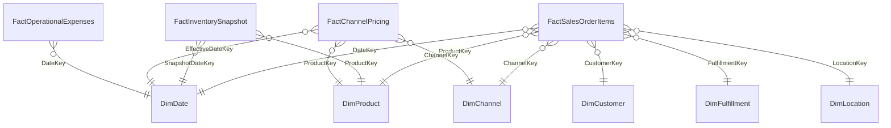

# HiLyst Unified Commerce — Gold Layer Data Catalog

> **Prototype Data Warehouse:** `HiLyst_UnifiedCommerceDW` 
> **Architecture:** Kimball Dimensional Star Schema 
> **Status:** Production-Ready & 100% Quality Validated 

---

## Gold Layer Dataset Inventory

| Entity Type | Table / File Name | Records | Columns | File Size | Description |
| :--- | :--- | :---: | :---: | :---: | :--- |
| Dimension | [`DimChannel.csv`](DimChannel.csv) | 11 | 5 | 0.73 KB | Multi-channel sales platforms (Amazon.in, International Wholesale B2B, Myntra, Ajio, Flipkart, Shopify Direct, etc.) |
| Dimension | [`DimCustomer.csv`](DimCustomer.csv) | 161 | 9 | 21.45 KB | B2B wholesale buyers and conformed retail customer accounts (161 accounts) |
| Dimension | [`DimDate.csv`](DimDate.csv) | 2,193 | 14 | 165.52 KB | Full calendar date dimension (2020–2025) with fiscal quarters, financial months, and weekend flags |
| Dimension | [`DimFulfillment.csv`](DimFulfillment.csv) | 11 | 6 | 0.88 KB | Fulfillment combinations (AFN / Amazon FBA, MFN / Merchant, Shiprocket, BlueDart, Expedited/Standard) |
| Dimension | [`DimLocation.csv`](DimLocation.csv) | 14,443 | 7 | 1097.92 KB | Standardized geographic dimension (14,443 distinct city, state, postal code combinations) |
| Dimension | [`DimProduct.csv`](DimProduct.csv) | 11,178 | 13 | 1502.97 KB | Conformed master catalog across Amazon, International wholesale, and stock reports (11,178 SKUs) |
| Fact Table | [`FactChannelPricing.csv`](FactChannelPricing.csv) | 10,350 | 10 | 1114.26 KB | Multi-channel pricing matrix, channel MRP, transfer costs, and retail margin spreads across platforms (10,350 records) |
| Fact Table | [`FactInventorySnapshot.csv`](FactInventorySnapshot.csv) | 9,188 | 9 | 811.63 KB | Point-in-time warehouse stock on hand, valuation at cost & MRP, and stockout reorder threshold triggers (9,188 SKUs) |
| Fact Table | [`FactOperationalExpenses.csv`](FactOperationalExpenses.csv) | 13 | 7 | 1.36 KB | Operational ledger expenses (Freight, International Exhibition, Storage, Warehouse Overhead) |
| Fact Table | [`FactSalesOrderItems.csv`](FactSalesOrderItems.csv) | 165,366 | 26 | 74954.2 KB | Central transactional sales grain (165,366 line items) with unit price, gross/net revenue, estimated margin, discounts, and order status flags |

---

## Star Schema Entity-Relationship Model

---

## Schema Column Definitions

### `DimChannel.csv` (11 rows)

**Total Columns:** `5` 
**Fields:** 
`ChannelKey`, `ChannelName`, `Platform`, `ChannelType`, `CreatedDate`

### `DimCustomer.csv` (161 rows)

**Total Columns:** `9` 
**Fields:** 
`CustomerKey`, `CustomerName`, `CustomerType`, `City`, `State`, `Country`, `SourceCustomerId`, `SourceSystem`, `CreatedDate`

### `DimDate.csv` (2,193 rows)

**Total Columns:** `14` 
**Fields:** 
`DateKey`, `FullDate`, `DayNumber`, `MonthNumber`, `MonthName`, `QuarterNumber`, `QuarterName`, `YearNumber`, `DayOfWeekNumber`, `DayName`, `IsWeekend`, `FinancialMonthNumber`, `FinancialQuarter`, `FinancialYear`

### `DimFulfillment.csv` (11 rows)

**Total Columns:** `6` 
**Fields:** 
`FulfillmentKey`, `FulfilmentMethod`, `ShipServiceLevel`, `CourierStatus`, `FulfilledBy`, `CreatedDate`

### `DimLocation.csv` (14,443 rows)

**Total Columns:** `7` 
**Fields:** 
`LocationKey`, `City`, `State`, `PostalCode`, `Country`, `Region`, `CreatedDate`

### `DimProduct.csv` (11,178 rows)

**Total Columns:** `13` 
**Fields:** 
`ProductKey`, `SKU`, `SourceSKU`, `StyleCode`, `Category`, `SubCategory`, `Size`, `Color`, `WeightKg`, `BaseMRP`, `TransferPrice`, `SourceSystem`, `CreatedDate`

### `FactChannelPricing.csv` (10,350 rows)

**Total Columns:** `10` 
**Fields:** 
`PricingKey`, `ProductKey`, `ChannelKey`, `EffectiveDateKey`, `ChannelMRP`, `TransferPrice`, `MarginSpreadAmount`, `MarginSpreadPct`, `SourceSystem`, `ETL_LoadedAt`

### `FactInventorySnapshot.csv` (9,188 rows)

**Total Columns:** `9` 
**Fields:** 
`InventoryKey`, `SnapshotDateKey`, `ProductKey`, `StockOnHandQuantity`, `ReorderThreshold`, `StockValueAtCost`, `StockValueAtMRP`, `SourceSystem`, `ETL_LoadedAt`

### `FactOperationalExpenses.csv` (13 rows)

**Total Columns:** `7` 
**Fields:** 
`ExpenseKey`, `DateKey`, `ExpenseCategory`, `ExpenseDescription`, `Amount`, `SourceSystem`, `ETL_LoadedAt`

### `FactSalesOrderItems.csv` (165,366 rows)

**Total Columns:** `26` 
**Fields:** 
`SalesItemKey`, `OrderID`, `DateKey`, `ProductKey`, `CustomerKey`, `ChannelKey`, `FulfillmentKey`, `LocationKey`, `OrderStatus`, `OrderCategoryStatus`, `IsCancelled`, `IsShipped`, `IsDelivered`, `IsReturned`, `Quantity`, `UnitPrice`, `GrossAmount`, `PromotionDiscount`, `NetAmount`, `EstimatedUnitCost`, `EstimatedGrossMargin`, `IsB2B`, `PromotionId`, `SourceSystem`, `SourceRecordID`, `ETL_LoadedAt`

