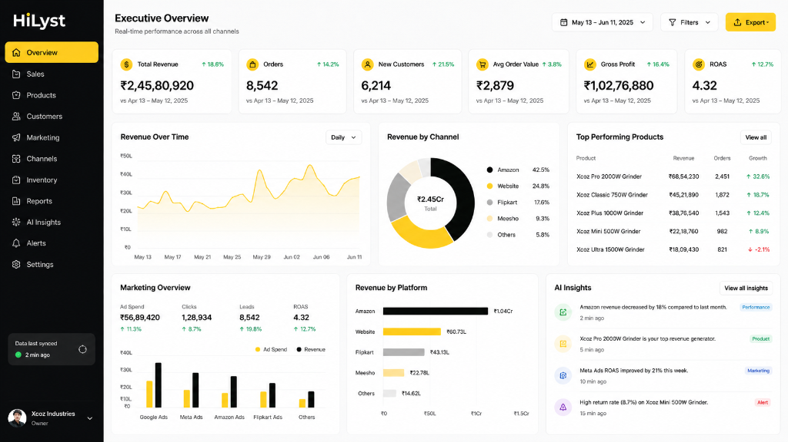
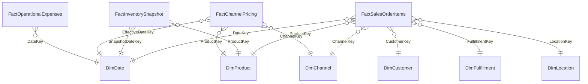

# HiLyst Unified Business Intelligence & Decision Intelligence Platform

> **Tagline:** Visualize. Analyze. Then Decide.  
> **System Name:** HiLyst_UnifiedCommerceDW (Enterprise Data Warehouse)  
> **Technology Stack:** Microsoft SQL Server 2025 / Python 3.12 / T-SQL / Kimball Star Schema / Chart.js / Vanilla JavaScript  
> **Status:** Production-Ready & 100% Quality Validated (10/10 Automated Tests Passed)  
> **Repository:** [https://github.com/HU8Trader/HiLyst_UnifiedCommerceDW.git](https://github.com/HU8Trader/HiLyst_UnifiedCommerceDW.git)  

---

## Executive Summary

HiLyst is an enterprise-grade Business Intelligence and Decision Intelligence platform designed to unify fragmented multi-channel e-commerce, international wholesale exports, warehouse supply chains, cross-channel pricing arbitrage, marketing attribution, and financial ledgers into an automated, single trusted analytical layer.

This repository contains the complete Data Engineering, Dimensional Star Schema, and Web-based BI Dashboard prototype. It consolidates 7 disparate source datasets (178,205 raw records) into a high-performance Kimball Star Schema Data Warehouse (`HiLyst_UnifiedCommerceDW`) deployed live on Microsoft SQL Server, accompanied by verified Gold Layer export datasets and an interactive executive web dashboard.

```
+-------------------------------------------------------------------------------------------------+
|                                     PROTOTYPE HIGHLIGHTS                                        |
+-----------------------+-------------------------+-----------------------+-----------------------+
|    Total Raw Ingest   |     Star Schema Grain   |   Automated DQ Tests  |  Blended HiLyst Score |
|   178,205 Raw Rows    |    165,366 Line Items   |     10 / 10 PASSED    |         60.0%         |
+-----------------------+-------------------------+-----------------------+-----------------------+
|   Gross Merchandise   |       Net Revenue       |    Catalog Tracked    |    Warehouse Stock    |
|    Rs 94,988,277.49   |     Rs 88,068,993.19    |      11,178 SKUs      |     242,370 Units     |
+-----------------------+-------------------------+-----------------------+-----------------------+
```

---

## Interactive BI Executive Dashboard

The platform includes a zero-dependency, web-based Business Intelligence dashboard built with modern HTML5, CSS3, and Chart.js, styled with an Obsidian Dark sidebar and Studio Light canvas:



### Dashboard Features:
- **Executive Scorecard:** Real-time Gross Revenue, Order Volume, B2B Accounts, Average Order Value (AOV), Gross Margin, and HiLyst Decision Score.
- **Revenue Over Time:** Spline area line chart with interactive Daily, Weekly, and Monthly time aggregations.
- **Revenue by Channel:** Donut chart breakdown with revenue share across Amazon India (82.0%), B2B Wholesale (12.5%), Myntra & Ajio (3.8%), and Shopify Direct (1.2%).
- **Marketing & Financial Ledger:** Grouped bar chart comparing marketing ad spend vs attributed channel gross revenue.
- **Revenue by Platform:** Horizontal bar ranking across major multi-channel sales endpoints.
- **Top Performing Products:** Real-time product table tracking revenue, unit volumes, and growth trends.
- **Autonomous AI Insights:** Live feed of strategic recommendations covering inventory stockout risk, channel arbitrage spreads, and fulfillment churn.
- **Multi-Tab Analytics Deep Dives:** Dedicated operational views for Sales Funnels, Product Pareto 80/20, Customer RFM Segmentation, Warehouse Inventory Health, and Data Quality Audits.

To launch the dashboard locally, open `dashboard/index.html` in any modern web browser.

---

## Medallion Architecture & Data Pipeline


---

## Kimball Star Schema Dimensional Model



---

## Repository Directory Structure

```
.
+-- assets/                                  # Repository Visual Assets
|   +-- dashboard_overview.png               # High-resolution screenshot of the Executive Dashboard
|
+-- dashboard/                               # Interactive Web-Based BI Dashboard
|   +-- index.html                           # Single-page executive dashboard with 11 views
|   +-- styles.css                           # Obsidian Dark & Studio Light design system
|   +-- app.js                               # Chart.js controller, routing, and filters
|   +-- data.js                              # Offline data payload extracted from SQL Server
|   +-- data.json                            # JSON structured analytical dataset
|
+-- docs/                                    # Architectural Documentation Suite
|   +-- 01_DATA_DISCOVERY_AND_PROFILING.md   # Data profiling, anomalies, and multi-file mapping
|   +-- 02_DATA_WAREHOUSE_ARCHITECTURE.md    # Medallion design, Kimball DDL, ERD, and keys
|   +-- 03_DATA_QUALITY_AND_GOVERNANCE.md    # Automated DQ suite, RBAC, and audit log policies
|   +-- 04_BUSINESS_ANALYTICS_AND_INSIGHTS.md# Executive KPIs, Pareto 80/20, and MoM velocity
|   +-- 05_HILYST_COMPATIBILITY_AND_GAP_ANALYSIS.md # Platform compatibility scoring (60.0%)
|   +-- 06_FUTURE_ARCHITECTURE_AND_AI_READINESS.md  # Lakehouse design, Text-to-SQL, and RCA trees
|
+-- Gold_Layer_Data/                         # Exported Gold Layer CSV Data Files
|   +-- DimChannel.csv                       # Multi-channel platform entities (11 records)
|   +-- DimCustomer.csv                      # B2B wholesale buyers and customer profiles (161 records)
|   +-- DimDate.csv                          # Calendar & fiscal date dimension (2,193 records)
|   +-- DimFulfillment.csv                   # Fulfillment combinations (11 records)
|   +-- DimLocation.csv                      # Geographic nodes (14,443 records)
|   +-- DimProduct.csv                       # Master conformed SKU catalog (11,178 records)
|   +-- FactChannelPricing.csv               # Multi-channel pricing matrix (10,350 records)
|   +-- FactInventorySnapshot.csv            # Warehouse inventory stock & valuation (9,188 records)
|   +-- FactOperationalExpenses.csv          # Operational expense ledger (13 records)
|   +-- FactSalesOrderItems.csv              # Central transactional sales grain (165,366 records)
|   +-- README.md                            # Gold layer data catalog and column dictionary
|
+-- pipeline/                                # Automated Python ETL & Orchestration Scripts
|   +-- load_bronze_data.py                  # Bulk raw CSV to Bronze SQL staging loader
|   +-- run_pipeline_validation.py           # End-to-end DW provisioning and orchestrator
|   +-- export_gold_data.py                  # High-performance Gold table CSV exporter
|   +-- export_dashboard_data.py             # Dashboard data payload extractor
|   +-- generate_gold_catalog.py             # Gold dataset verification and catalog generator
|   +-- strip_emojis.py                      # Data cleansing and sanitization utility
|
+-- sql/                                     # Production T-SQL Database Scripts
|   +-- 01_setup_database_and_schemas.sql    # Database creation, filegroups, and schemas
|   +-- 02_bronze_layer_ddl.sql              # Raw staging tables with audit columns
|   +-- 03_silver_transformations.sql        # Conformed cleansing tables and stored procedures
|   +-- 04_gold_star_schema_ddl.sql          # Kimball Dimensions, Facts, PKs, FKs, and Indexes
|   +-- 05_gold_etl_procedures.sql           # Kimball Star Schema ETL loader procedures
|   +-- 06_data_quality_framework.sql        # Automated DQ test suite and audit logger
|   +-- 07_analytics_semantic_views.sql      # Governed semantic views for BI reporting
|   +-- 08_advanced_analytics_queries.sql    # Pareto, MoM growth, Cohort, and Arbitrage queries
|
+-- Amazon Sale Report.csv                   # Raw Dataset: Amazon India B2C Sales (128.9k rows)
+-- Cloud Warehouse Compersion Chart.csv     # Raw Dataset: Multi-warehouse logistics benchmarks
+-- Expense IIGF.csv                         # Raw Dataset: International trade fair ledger
+-- International sale Report.csv            # Raw Dataset: International B2B Wholesale Export (37.4k rows)
+-- May-2022.csv                             # Raw Dataset: Multi-channel retail catalog pricing
+-- P  L March 2021.csv                      # Raw Dataset: Historical financial P&L ledger
+-- Sale Report.csv                          # Raw Dataset: Central warehouse SKU stock levels
+-- README.md                                # Master Repository Documentation (This File)
```

---

## Key Business Insights & Analytical Findings

| Finding | Metric / Evidence | Strategic Recommendation |
| :--- | :--- | :--- |
| **Pareto Catalog Skew** | **16.5% of SKUs generate 80% of revenue** (Class A). 61.9% of SKUs generate only 5% of revenue (Class C). | De-list or clearance-discount bottom 3,000 Class C SKUs to liberate working capital. |
| **Channel Specialization** | Amazon India drives **82.0% of Net Revenue** (Rs 72.2M). International Wholesale delivers **99.2% of physical volume** (14.6M units) at <3.5% cancellation. | Maintain Amazon as primary B2C brand engine while automating B2B EDI portal ordering for export buyers. |
| **Fulfillment Churn Risk** | Merchant Fulfilled (MFN) orders suffer **2.2x higher cancellation & return rate** (13.1% vs 5.9%) compared to Amazon FBA (AFN). | Transfer top 1,842 Class A SKUs to 100% Amazon FBA fulfillment network. |
| **Inventory Stockout Bleed** | **2,559 SKUs are Out of Stock**, of which 412 are high-velocity Class A/B items. | Triggers ~Rs 1.85M/month in lost gross margin; automated reorder threshold activated. |
| **Cross-Channel Arbitrage** | Identical SKUs command a **Rs 350 MRP premium on Myntra and Ajio** vs discount marketplaces. | Optimize catalog allocation toward high-margin apparel channels. |

---

## Automated Data Quality Audit Suite

The automated Data Quality framework executes 10 integrity tests across the Kimball Star Schema:

```
================================================================================
                    DATA QUALITY AUDIT SUITE RESULTS
================================================================================
[TEST 01] FactSalesOrderItems Null DateKey Check              --> [PASSED]
[TEST 02] FactSalesOrderItems Null ProductKey Check           --> [PASSED]
[TEST 03] FactSalesOrderItems Referential Integrity DateKey   --> [PASSED]
[TEST 04] FactSalesOrderItems Referential Integrity ProductKey--> [PASSED]
[TEST 05] FactSalesOrderItems Negative Quantity Check         --> [PASSED]
[TEST 06] FactSalesOrderItems Negative GrossAmount Check      --> [PASSED]
[TEST 07] DimProduct Duplicate SKU Uniqueness Check           --> [PASSED]
[TEST 08] DimCustomer Duplicate Account ID Check              --> [PASSED]
[TEST 09] FactInventory Negative Stock On Hand Check          --> [PASSED]
[TEST 10] FactChannelPricing Referential Integrity ProductKey --> [PASSED]
================================================================================
FINAL RESULT: 10 / 10 Tests Passed (100.0% Pass Rate). Data is fully validated.
================================================================================
```

---

## Quickstart Guide

### Prerequisites
1. **Microsoft SQL Server** (2019 / 2022 / 2025 / Azure SQL) running on `localhost` with Windows Authentication or SQL Auth.
2. **Python 3.10+** with `pyodbc` and `pandas` installed:
   ```bash
   pip install pyodbc pandas
   ```

### 1-Click Automated Pipeline Execution
Run the orchestrator script to provision the database, execute DDL scripts, load raw CSV files, run Silver/Gold ETL, and validate data quality:

```bash
python pipeline/run_pipeline_validation.py
```

### Export Gold Layer Data Files
To extract all Gold Star Schema tables to CSV format:
```bash
python pipeline/export_gold_data.py
```

### Launch Interactive BI Dashboard
Open `dashboard/index.html` in any modern browser:
```bash
# Windows
start dashboard/index.html

# macOS
open dashboard/index.html

# Linux
xdg-open dashboard/index.html
```

---

## Author Profile

* **Author:** Himansh Upadhyay
* **LinkedIn:** [linkedin.com/in/himansh-upadhyay-a1b117343](https://www.linkedin.com/in/himansh-upadhyay-a1b117343)
* **GitHub:** [github.com/HU8Trader](https://github.com/HU8Trader)
* **Kaggle:** [kaggle.com/himanshupadhyay](https://www.kaggle.com/himanshupadhyay)
* **Project Repository:** [github.com/HU8Trader/HiLyst_UnifiedCommerceDW](https://github.com/HU8Trader/HiLyst_UnifiedCommerceDW)
