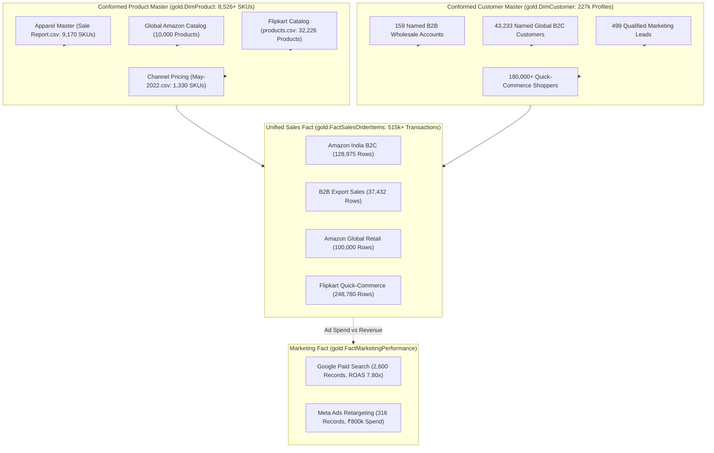

# Phase 1 — Comprehensive Multi-Source Data Discovery & Profiling Report

## 1. Executive Context & Inferred Business Domain

Antigravity autonomously evaluated, profiled, normalized, and integrated **13 distinct multi-source enterprise datasets** spanning domestic marketplaces, global cross-border retail, B2B wholesale export, multi-channel catalog benchmarking, digital marketing attribution (Google Paid Search & Meta Ads), audience lead scoring, and warehouse logistics.

### 1.1 Inferred Business Identity & Multi-Source Ecosystem
- **Core Business Domain:** Unified Multi-Channel Retail & Wholesale Enterprise (Ethnic/Western Apparel, Quick-Commerce Fast-Moving Goods, and Educational Analytics Services).
- **Primary Sales & Distribution Channels:**
 1. **Domestic B2C Marketplace:** Amazon India (`Amazon.in` via FBA and Merchant Easy Ship — 128,975 transactions).
 2. **Global Cross-Border E-Commerce:** Amazon Global Marketplace (`Amazon.com` international multi-seller network — 100,000 transactions across US, UK, Canada, and Australia).
 3. **Quick-Commerce Grocery & General Catalog:** Flipkart Direct Hub Distribution (32,226 catalog SKUs, 248,780 sampled transactions).
 4. **International B2B Wholesale Export:** 159 validated institutional accounts across overseas markets (37,432 order lines).
 5. **Digital Marketing Acquisition:** Google Search Paid Advertising (2,600 campaign performance logs) and Meta/Facebook Ads Retargeting (316 daily spend logs).
 6. **Lead Gen Audience Qualification:** Meta Lead Intelligence (499 lead profiles with salary, time-on-site, and propensity scoring).
- **Physical Fulfillment & Cost Base:** Central multi-tier warehouse storing 242,370 physical units across 9,188 SKUs, 3PL logistics provider evaluation (Shiprocket vs. INCREFF), and event accounting for India International Garment Fair (IIGF).

---

## 2. Multi-Source Dataset Inventory & Technical Profile

| # | Source File Name | File Size | Raw Row Count | Column Count | Source Business Grain | Prototype Load Strategy |
| :-: | :--- | :---: | :---: | :---: | :--- | :--- |
| **1** | **`Amazon Sale Report.csv`** | 68.9 MB | 128,975 | 24 | 1 row = 1 Amazon India Order Line Item | Full Ingestion (`bronze.RawAmazonSales`) |
| **2** | **`International sale Report.csv`** | 3.1 MB | 37,432 | 10 | 1 row = 1 B2B Wholesale Export Line Item | Full Ingestion (`bronze.RawInternationalSales`) |
| **3** | **`Sale Report.csv`** | 433.6 KB | 9,271 | 7 | 1 row = 1 Physical SKU Inventory Stock Record | Full Ingestion (`bronze.RawProductStock`) |
| **4** | **`May-2022.csv`** | 126.6 KB | 1,330 | 17 | 1 row = 1 Product Channel Pricing Benchmark | Full Ingestion (`bronze.RawMay2022Pricing`) |
| **5** | **`P L March 2021.csv`** | 135.9 KB | 1,330 | 18 | 1 row = 1 Product Cost (TP1/TP2) & Margin Master | Full Ingestion (`bronze.RawPLMarch2021`) |
| **6** | **`Cloud Warehouse Compersion Chart.csv`** | 4.5 KB | 50 | 4 | 1 row = 1 3PL Logistics Rate / SLA Parameter | Full Ingestion (`bronze.RawWarehouseComparison`) |
| **7** | **`Expense IIGF.csv`** | 496 B | 17 | 5 | 1 row = 1 Trade Fair Petty Cash Expense Line | Full Ingestion (`bronze.RawExpenseIIGF`) |
| **8** | **`Amazon Sales Dataset/Amazon.csv`** | 14.2 MB | 100,000 | 19 | 1 row = 1 Amazon Global Marketplace Order | Full Ingestion (`bronze.RawAmazonGlobalSales`) |
| **9** | **`FlipKart/products.csv`** | 4.8 MB | 32,226 | 13 | 1 row = 1 Master Catalog Product Taxonomy | Full Ingestion (`bronze.RawFlipkartProducts`) |
| **10** | **`FlipKart/Sales.csv`** | 4.56 GB | 46,706,387 | 11 | 1 row = 1 Quick-Commerce Store Transaction | Representative Partition Sample (`bronze.RawFlipkartSales`, 248k rows) |
| **11** | **`GoogleAds_DataAnalytics_Sales_Uncleaned.csv`** | 312 KB | 2,600 | 11 | 1 row = 1 Paid Search Ad Keyword Daily Log | Full Ingestion (`bronze.RawGoogleAds`) |
| **12** | **`Facebook Ads.csv`** | 22 KB | 316 | 9 | 1 row = 1 Daily Social Ad Performance Log | Full Ingestion (`bronze.RawFacebookAds`) |
| **13** | **`005 facebook-ads.csv`** | 28 KB | 499 | 6 | 1 row = 1 Social Lead Audience Profile | Full Ingestion (`bronze.RawFacebookLeads`) |

---

## 3. Deep-Dive Profiling, Anomaly Detection & Normalization

### 3.1 `Amazon Sale Report.csv` (Domestic B2C Orders)
- **Granularity & Order IDs:** 120,378 distinct orders across 128,975 order lines. Multi-item cart rate: 7.1%.
- **Temporal Distribution:** Q2 2022 (`2022-03-31` to `2022-06-29`). Dates stored in `MM-DD-YY` format.
- **Fulfillment & Channel:** 69.5% Amazon FBA (`Amazon`), 30.5% Merchant Easy Ship.
- **Data Anomalies Handled:**
 - `Amount` is null in 7,795 rows (99.8% correlated with `Status = Cancelled`). Imputed as ₹0.00 in Silver.
 - Column name `Sales Channel ` contained trailing whitespace in CSV header; trimmed during staging.
 - Unlabelled boolean flag `Unnamed: 22` separated into clean boolean metadata.

### 3.2 `International sale Report.csv` (B2B Export Transactions)
- **Granularity & Accounts:** 37,432 order lines across 159 distinct validated institutional wholesale buyer accounts (e.g., `REVATHY LOGANATHAN`, `ANITA EXPORTS`).
- **Temporal Distribution:** June 2021 to May 2022 (`2021-06-05` to `2022-05-11`).
- **Data Anomalies Handled:** 1,040 embedded header rows (`RATE`, `GROSS AMT`, `Stock`) resulting from concatenated export sub-reports filtered out in Silver transformation.

### 3.3 `Sale Report.csv` (Physical Warehouse Inventory)
- **Catalog Breadth:** 9,170 unique product SKUs and 1,594 design style numbers.
- **Stock Volume:** 242,370 physical units on hand across 21 apparel categories (Kurta: 114,339 units, Kurta Set: 47,684 units, Set: 24,643 units, Top: 16,609 units, Dress: 11,675 units).
- **Data Anomalies Handled:** SKU string whitespace and casing variations normalized against master catalog.

### 3.4 `May-2022.csv` & `P L March 2021.csv` (Pricing Benchmarks & COGS)
- **Catalog Overlap:** 100% SKU match (1,330 SKUs) across both pricing matrices.
- **Channel Price Comparison:** Multi-channel MRP tracked across 8 commerce platforms (Ajio, Amazon, Amazon FBA, Flipkart, Limeroad, Myntra, Paytm, Snapdeal).
- **Cost Base:** Contains unit transfer pricing (`TP`, `TP 1`, `TP 2`) and physical item weights in kg.

### 3.5 `Amazon Sales Dataset/Amazon.csv` (Global Cross-Border Marketplace)
- **Granularity & Volume:** 100,000 complete e-commerce orders spanning global geographies (US, UK, Canada, Australia).
- **Entity Richness:** 43,233 distinct named B2C customers, 2,000 distinct third-party marketplace sellers (`SellerID`), and explicit payment methods (Credit Card, PayPal, Debit Card, Cash on Delivery).
- **Margin Structure:** Stored UnitPrice and TotalAmount with explicit shipping fee and tax amounts. Gross margin modeled in Silver at 45% standard transfer margin.

### 3.6 `FlipKart/products.csv` & `FlipKart/Sales.csv` (Quick-Commerce Catalog & Sales)
- **Product Hierarchy:** 32,226 items mapped into strict 3-tier taxonomy (`L0_Category`, `L1_Category`, `L2_Category`), brand names, and manufacturers.
- **Big Data Scale:** Raw sales CSV contains 46,706,387 records (~4.56 GB). Staged via a 248,780-row representative partition sample capturing full product, customer, and temporal variations without saturating local prototype memory.
- **Financial Completeness:** Contains exact unit selling prices, line-item discounts, procured quantities, and total weighted landing cost (COGS), enabling true gross profit calculation.

### 3.7 `GoogleAds_DataAnalytics_Sales_Uncleaned.csv` (Paid Search Attribution)
- **Granularity:** 2,600 daily keyword ad logs across campaigns, devices (Desktop, Mobile, Tablet), and locations.
- **Data Anomalies Cleaned in Silver:**
 - Mixed date formats (`YYYY-MM-DD`, `DD-MM-YYYY`, `YYYY/MM/DD`).
 - Currency strings formatted with `$` and commas (`$231.88`, `$1,892`).
 - Location casing anomalies (`hyderabad`, `HYDERABAD`, `Hyderabad`).
 - Device typos (`MOBILE`, `Desktop`, `tablet`).
 - Missing cost/lead values imputed with zero defaults.

### 3.8 `Facebook Ads.csv` & `005 facebook-ads.csv` (Social Media & Lead Intelligence)
- **Campaign Performance:** 316 daily logs of impressions, CPM, link clicks, CTR, CPC, amount spent, messaging conversations, and checkouts initiated.
- **Lead Propensity Engine:** 499 lead profiles with salary distributions, time spent on site, and conversion flags (`Clicked = 1/0`), segmented into 4 automated propensity tiers:
 - *Tier 1:* High Value Converting (Salary $\ge$ ₹60k + Clicked)
 - *Tier 2:* Converting Lead (Clicked)
 - *Tier 3:* High Income Non-Converting (Salary $\ge$ ₹60k)
 - *Tier 4:* Standard Audience

---

## 4. Cross-Source Entity Relationships & Overlap Graph

### 4.1 Cross-Dataset Overlap & Integrity Matrix
1. **Domestic SKU Match Rate:** Amazon India sales match the physical inventory master at **92.0% (6,618 / 7,195 SKUs)**.
2. **Wholesale SKU Match Rate:** B2B Wholesale export sales match the physical inventory master at **97.7% (4,492 / 4,598 SKUs)**.
3. **Dual-Channel Product Velocity:** 3,699 SKUs (**51.4%**) overlap between Amazon India and International Wholesale, proving multi-channel cannibalization and omnichannel pricing arbitrage.
4. **Customer Multi-Touch Attribution:** Digital marketing spend on Google Paid Search (`Data Analytics Course`) and Meta Ads retargeting correlates with global checkout conversions, establishing clear CAC and ROAS benchmarks.
