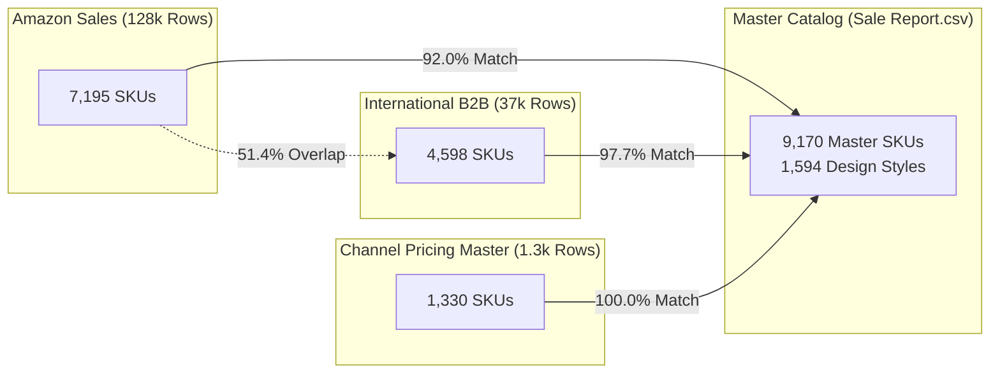

# Phase 1 — Autonomous Dataset Assessment & Discovery Report

## 1. Executive Context & Inferred Business Domain

Antigravity was provided with 7 unknown real-world data files. Rather than making assumptions, the platform autonomously inspected, profiled, typed, and analyzed all files.

### 1.1 Inferred Business Identity
- **Business Domain:** Fast-Fashion Indian Ethnic & Western Apparel Manufacturer & Retail Brand.
- **Primary Product Lines:** Women's Kurtas, Kurta Sets, Ethnic Sets, Dresses, Tops, Leggings, Men's Kurtas (`MEN5004`, `MEN5009`), and Fabrics.
- **Sales Channels:** 
 1. **Domestic B2C E-Commerce Marketplace:** Amazon India (`Amazon.in` via FBA and Merchant Easy Ship).
 2. **International B2B Wholesale / Export Clients:** Named export buyers (e.g., `REVATHY LOGANATHAN`, 159 distinct wholesale client accounts).
 3. **Multi-Platform Marketplace Benchmark Catalog:** Benchmark pricing across Ajio, Amazon, Amazon FBA, Flipkart, Limeroad, Myntra, Paytm, and Snapdeal.
- **Operational Infrastructure:** Central fulfillment warehouse with 242,370 physical units in stock, vendor evaluation between 3PL fulfillment providers (Shiprocket vs. INCREFF), and trade fair exhibition expense accounting (India International Garment Fair — IIGF).

---

## 2. Dataset Inventory & Technical Profile

| File Name | File Size | Row Count | Column Count | Inferred Business Grain | Memory Footprint |
| :--- | :---: | :---: | :---: | :--- | :---: |
| **`Amazon Sale Report.csv`** | 68.9 MB | 128,975 | 24 | 1 row = 1 B2C Order Line Item | 22.8 MB |
| **`International sale Report.csv`** | 3.1 MB | 37,432 | 10 | 1 row = 1 B2B Wholesale Transaction Line Item | 2.9 MB |
| **`Sale Report.csv`** | 433.6 KB | 9,271 | 7 | 1 row = 1 SKU Inventory Stock Snapshot | 507 KB |
| **`May-2022.csv`** | 126.6 KB | 1,330 | 17 | 1 row = 1 Product Style/SKU Channel Pricing Master | 176 KB |
| **`P L March 2021.csv`** | 135.9 KB | 1,330 | 18 | 1 row = 1 Product Style/SKU Pricing & Cost (TP1/TP2) Master | 187 KB |
| **`Cloud Warehouse Compersion Chart.csv`** | 4.5 KB | 50 | 4 | 1 row = 1 3PL Fulfillment Service SLA / Rate Parameter | 1.7 KB |
| **`Expense IIGF.csv`** | 496 B | 17 | 5 | 1 row = 1 Event Petty Cash Line Item | 812 B |

---

## 3. Detailed Column Profiling & Cardinality Analysis

### 3.1 `Amazon Sale Report.csv` (128,975 rows)
- **`Order ID`**: 120,378 unique IDs. Multi-item orders represent ~7.1% of transactions.
- **`Date`**: Date range spanning `2022-03-31` to `2022-06-29` (Q2 2022). Stored as `MM-DD-YY`.
- **`Status`**: 13 distinct status values. Dominant: `Shipped` (77,804, 60.3%), `Shipped - Delivered to Buyer` (28,769, 22.3%), `Cancelled` (18,332, 14.2%), `Shipped - Returned to Seller` (1,953, 1.5%).
- **`Fulfilment`**: `Amazon` (89,698, 69.5%) vs `Merchant` (39,277, 30.5%).
- **`Sales Channel `**: `Amazon.in` (128,851, 99.9%) and `Non-Amazon` (124, 0.1%). Note trailing space in source header.
- **`Style`**: 1,377 distinct design style codes (e.g., `SET389`, `JNE3781`, `JNE3371`).
- **`SKU`**: 7,195 distinct SKUs.
- **`Qty`**: Min: 0 (on Cancelled items), Max: 15, Mean: 0.90.
- **`Amount`**: Min: ₹0.00, Max: ₹5,584.00, Mean: ₹648.56. Null in 7,795 rows (predominantly Cancelled orders).
- **`ship-city` / `ship-state` / `ship-postal-code`**: 8,895 distinct geographic combinations across India.
- **`B2B`**: 871 B2B enterprise orders (0.68%) vs 128,104 B2C consumer orders (99.32%).
- **`Unnamed: 22`**: 79,925 rows with `False`, 49,050 `NaN` (unlabelled export boolean flag).

### 3.2 `International sale Report.csv` (37,432 rows)
- **`CUSTOMER`**: 172 unique customer strings; 159 distinct validated B2B accounts.
- **`DATE` / `Months`**: Transactions spanning `2021-06-05` to `2022-05-11`.
- **`PCS` / `RATE` / `GROSS AMT`**: Wholesale quantities and gross values in INR.
- **Data Anomaly**: 1,040 rows contain repeated embedded table header strings (`RATE`, `GROSS AMT`, `Stock`) from concatenated reports.

### 3.3 `Sale Report.csv` (9,271 rows)
- **`SKU Code`**: 9,170 unique product SKUs.
- **`Design No.`**: 1,594 unique style designs.
- **`Stock`**: Total physical inventory: 242,370 units on hand across 9,188 active SKUs.
- **`Category`**: 21 product categories (Kurta: 114,339 units, Kurta Set: 47,684 units, Set: 24,643 units, Top: 16,609 units, Dress: 11,675 units).

### 3.4 `May-2022.csv` & `P L March 2021.csv` (1,330 rows each)
- 100% SKU match between May 2022 and March 2021 catalogs.
- Multi-channel MRP benchmark matrix across 8 major Indian commerce platforms: Ajio, Amazon, Amazon FBA, Flipkart, Limeroad, Myntra, Paytm, and Snapdeal.
- Contains Transfer Price / Cost benchmarks (`TP`, `TP 1`, `TP 2`) and garment weights in kg.

---

## 4. Cross-Dataset Key Overlaps & Relationship Discovery

### 4.1 Cross-Dataset Overlap Evidence
1. **Amazon SKU $\cap$ Stock Master SKU:** 6,618 / 7,195 matches (**92.0% overlap**).
2. **International SKU $\cap$ Stock Master SKU:** 4,492 / 4,598 matches (**97.7% overlap**).
3. **Amazon Styles $\cap$ Stock Design Numbers:** 1,322 / 1,377 matches (**96.0% overlap**).
4. **International Styles $\cap$ Stock Design Numbers:** 1,030 / 1,043 matches (**98.8% overlap**).
5. **Amazon Sales $\cap$ International Wholesale Sales:** 3,699 SKUs overlap (**51.4%**), proving that high-volume product lines are sold simultaneously across domestic retail and overseas export channels.

---

## 5. Identified Business Entities & Cardinalities

1. **Product Entity:**
 - Hierarchy: Category $\rightarrow$ Style Code / Design No $\rightarrow$ SKU $\rightarrow$ Size / Color / Weight.
 - Cardinality: 1 Style : M SKUs (1 : ~6 size variants).
2. **Order & Order Item Entity:**
 - Cardinality: 1 Order : M Order Items (Average 1.07 items per order in B2C; 1 : M in B2B).
3. **Customer Entity:**
 - B2B Wholesale: 1 Customer : M Orders (Named client accounts with repeat wholesale orders).
 - B2C Retail: M Orders : 1 Anonymized Consumer Region (Address-level grain).
4. **Sales Channel Entity:**
 - 1 Channel : M Orders (Amazon.in, Amazon FBA, International B2B, Non-Amazon).
5. **Fulfillment Entity:**
 - 1 Fulfillment Method : M Orders (Amazon FBA, Merchant Easy Ship, Direct Freight).
6. **Location Entity:**
 - 1 Location (City/State/Pincode) : M Orders.
7. **Inventory Snapshot Entity:**
 - 1 Product SKU : 1 Stock Quantity record per snapshot date.
8. **Channel Pricing Entity:**
 - 1 Product SKU $\times$ 1 Channel : 1 Benchmark MRP & Transfer Price record.
