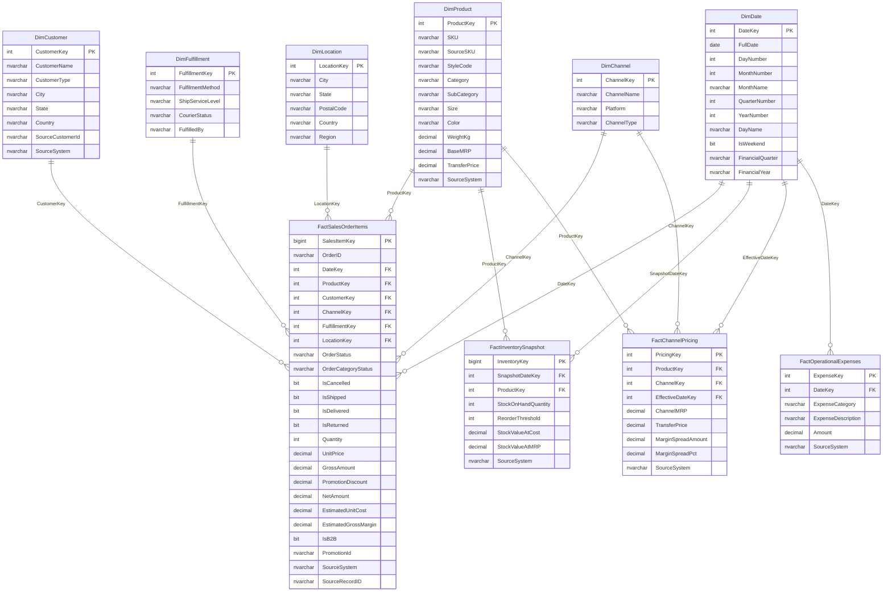

# Phase 2 — Data Warehouse Architecture & Dimensional Modeling

## 1. Medallion Architecture Overview

The **HiLyst Unified Commerce Data Warehouse (`HiLyst_UnifiedCommerceDW`)** is structured around the Medallion Architecture pattern implemented on Microsoft SQL Server.

```mermaid
flowchart TD
 subgraph Layer0["Raw Source Feeds"]
 F1["Amazon Sale Report.csv"]
 F2["International sale Report.csv"]
 F3["Sale Report (Stock).csv"]
 F4["May-2022.csv & P&L 2021.csv"]
 F5["Expense & 3PL CSVs"]
 end

 subgraph Layer1["Bronze Layer (Raw Staging)"]
 B1["bronze.RawAmazonSales"]
 B2["bronze.RawInternationalSales"]
 B3["bronze.RawProductStock"]
 B4["bronze.RawMay2022Pricing"]
 B5["bronze.RawExpenseIIGF"]
 end

 subgraph Layer2["Silver Layer (Conformed Relational)"]
 S1["silver.CleanAmazonOrders"]
 S2["silver.CleanWholesaleSales"]
 S3["silver.CleanInventoryStock"]
 S4["silver.CleanProductPricing"]
 S5["silver.CleanOperationalExpenses"]
 end

 subgraph Layer3["Gold Layer (Kimball Star Schema)"]
 D1["gold.DimDate"]
 D2["gold.DimProduct"]
 D3["gold.DimCustomer"]
 D4["gold.DimChannel"]
 D5["gold.DimFulfillment"]
 D6["gold.DimLocation"]

 F1_Gold["gold.FactSalesOrderItems"]
 F2_Gold["gold.FactInventorySnapshot"]
 F3_Gold["gold.FactChannelPricing"]
 F4_Gold["gold.FactOperationalExpenses"]
 end

 subgraph Layer4["Analytics Layer (Semantic & Decision)"]
 V1["analytics.vw_DailySalesSummary"]
 V2["analytics.vw_ProductPerformance"]
 V3["analytics.vw_ChannelProfitability"]
 V4["analytics.vw_CustomerRFM"]
 V5["analytics.vw_InventoryHealth"]
 V6["analytics.vw_ExecutiveKPIs"]
 AI["HiLyst AI Decision Agent"]
 end

 Layer0 --> Layer1
 Layer1 --> Layer2
 Layer2 --> Layer3
 Layer3 --> Layer4
```

---

## 2. Medallion Layer Responsibilities

### 2.1 Bronze Layer (Raw Storage)
- **Objective:** Ingest source files with zero data loss and 100% fidelity.
- **Audit Columns:** Every Bronze table appends:
 - `_SourceRowId BIGINT IDENTITY(1,1)`: Deterministic physical row sequence.
 - `_IngestedAt DATETIME2`: Exact UTC ingestion timestamp.
 - `_SourceFile NVARCHAR(260)`: Source file provenance and lineage.

### 2.2 Silver Layer (Cleaned & Conformed)
- **Objective:** Data type safety, null resolution, deduplication, casing standardization, and business logic conformance.
- **Standardization Activities:**
 - Date parsing into standard ISO `DATE` format and integer `DateKey` (`YYYYMMDD`).
 - Removal of embedded table headers and corrupted pagination records.
 - State and city standardization across all 28 Indian states & UTs.
 - Parsing currency and quantities into proper SQL numeric types (`DECIMAL(18,2)` and `INT`).
 - Normalization of boolean indicators (`IsB2B`, `HasPromotion`, `IsCancelled`).

### 2.3 Gold Layer (Kimball Dimensional Star Schema)
- **Objective:** Highly performant, business-ready analytical data model optimized for BI queries, Power BI DAX expressions, and AI text-to-SQL querying.
- **Surrogate Keys:** All dimensions utilize integer surrogate keys (`ProductKey`, `CustomerKey`, `ChannelKey`, `LocationKey`, `FulfillmentKey`, `DateKey`).
- **Source Lineage:** All Fact tables preserve `SourceSystem` and `SourceRecordID` for 100% backward traceability.

### 2.4 Analytics Layer (Governed Semantic Boundary)
- **Objective:** Provide a secure, governed access boundary for AI agents and BI tools.
- **Capabilities:** Pre-computed business metrics, single-pass analytical CTE views, RFM segmentation, and inventory depletion velocity.

---

## 3. Entity-Relationship Diagram (Gold Star Schema)

---

## 4. End-to-End Data Lineage & Mapping

| Source File | Source Column | Silver Transformation Rule | Silver Target Column | Gold Target Table & Column |
| :--- | :--- | :--- | :--- | :--- |
| `Amazon Sale Report.csv` | `Order ID` | `LTRIM(RTRIM(OrderID))` | `silver.CleanAmazonOrders.OrderID` | `gold.FactSalesOrderItems.OrderID` |
| `Amazon Sale Report.csv` | `Date` | `TRY_CONVERT(DATE, Date, 1)` | `silver.CleanAmazonOrders.OrderDate` | `gold.FactSalesOrderItems.DateKey` $\rightarrow$ `DimDate` |
| `Amazon Sale Report.csv` | `SKU` | `UPPER(TRIM(SKU))` | `silver.CleanAmazonOrders.SKU` | `gold.DimProduct.SKU`, `FactSales.ProductKey` |
| `Amazon Sale Report.csv` | `Qty` | `ISNULL(TRY_CAST(Qty AS INT), 0)` | `silver.CleanAmazonOrders.Quantity` | `gold.FactSalesOrderItems.Quantity` |
| `Amazon Sale Report.csv` | `Amount` | `ISNULL(TRY_CAST(Amount AS DECIMAL), 0)` | `silver.CleanAmazonOrders.GrossAmount` | `gold.FactSalesOrderItems.GrossAmount` |
| `Amazon Sale Report.csv` | `ship-state` | Standardized uppercase mapping | `silver.CleanAmazonOrders.ShipState` | `gold.DimLocation.State` |
| `International sale Report.csv` | `CUSTOMER` | `UPPER(TRIM(CUSTOMER))` | `silver.CleanWholesaleSales.CustomerName` | `gold.DimCustomer.CustomerName` |
| `International sale Report.csv` | `GROSS AMT` | `TRY_CAST(REPLACE(AMT, ',', '') AS DECIMAL)` | `silver.CleanWholesaleSales.GrossAmount` | `gold.FactSalesOrderItems.GrossAmount` |
| `Sale Report.csv` | `Stock` | `ISNULL(TRY_CAST(Stock AS INT), 0)` | `silver.CleanInventoryStock.StockOnHand` | `gold.FactInventorySnapshot.StockOnHandQuantity` |
| `May-2022.csv` | `Amazon MRP` | `TRY_CAST(Amazon MRP AS DECIMAL)` | `silver.CleanProductPricing.AmazonMRP` | `gold.FactChannelPricing.ChannelMRP` |
| `May-2022.csv` | `TP` | `TRY_CAST(TP AS DECIMAL)` | `silver.CleanProductPricing.TransferPrice` | `gold.DimProduct.TransferPrice`, `FactPricing.TransferPrice` |
| `Expense IIGF.csv` | `Unnamed: 3` | `TRY_CAST(Unnamed: 3 AS DECIMAL)` | `silver.CleanOperationalExpenses.Amount` | `gold.FactOperationalExpenses.Amount` |
