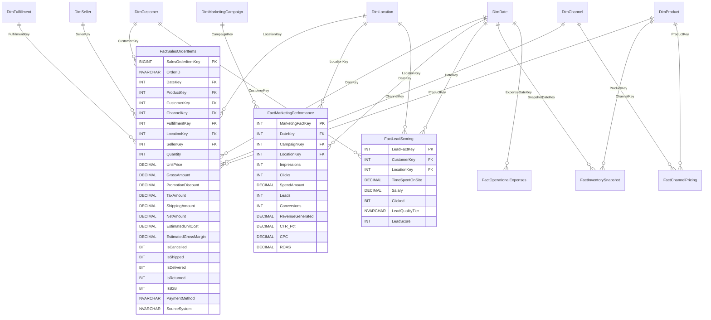

# Phase 2 — Unified Data Warehouse Architecture & Kimball Star Schema

## 1. Enterprise Medallion Architecture Overview

The **HiLyst Unified Business Intelligence & Decision Intelligence Platform (`HiLyst_UnifiedCommerceDW`)** is architected around a 4-tier Medallion Architecture pattern implemented on Microsoft SQL Server with snapshot isolation (`READ_COMMITTED_SNAPSHOT ON`).

```mermaid
flowchart TD
 subgraph Layer0["Multi-Source Enterprise Ingestion (13 Feeds)"]
 F1["Amazon India Sales CSV (128k)"]
 F2["International Wholesale Export CSV (37k)"]
 F3["Physical Inventory Stock CSV (9.2k)"]
 F4["Channel Pricing & Cost Masters (2.6k)"]
 F5["Warehouse SLA & Petty Cash CSVs"]
 F6["Amazon Global Marketplace CSV (100k)"]
 F7["Flipkart Taxonomy Master (32.2k)"]
 F8["Flipkart Quick-Commerce Sales (248k sampled)"]
 F9["Google Ads Paid Search CSV (2.6k)"]
 F10["Meta Ads Retargeting CSV (316)"]
 F11["Meta Lead Propensity CSV (499)"]
 end

 subgraph Layer1["Bronze Layer (Raw Multi-Source Staging)"]
 B1["bronze.RawAmazonSales"]
 B2["bronze.RawInternationalSales"]
 B3["bronze.RawProductStock"]
 B4["bronze.RawMay2022Pricing"]
 B5["bronze.RawPLMarch2021"]
 B6["bronze.RawWarehouseComparison"]
 B7["bronze.RawExpenseIIGF"]
 B8["bronze.RawAmazonGlobalSales"]
 B9["bronze.RawFlipkartProducts"]
 B10["bronze.RawFlipkartSales"]
 B11["bronze.RawGoogleAds"]
 B12["bronze.RawFacebookAds"]
 B13["bronze.RawFacebookLeads"]
 end

 subgraph Layer2["Silver Layer (Cleansed & Conformed Relational Master)"]
 S1["silver.CleanAmazonOrders"]
 S2["silver.CleanWholesaleSales"]
 S3["silver.CleanInventoryStock"]
 S4["silver.CleanProductPricing"]
 S5["silver.CleanOperationalExpenses"]
 S6["silver.CleanAmazonGlobalOrders"]
 S7["silver.CleanFlipkartProducts"]
 S8["silver.CleanFlipkartSales"]
 S9["silver.CleanGoogleAds"]
 S10["silver.CleanFacebookAds"]
 S11["silver.CleanFacebookLeads"]
 end

 subgraph Layer3["Gold Layer (Kimball Dimensional Star Schema)"]
 D1["gold.DimDate (2,193 Days)"]
 D2["gold.DimProduct (8,576 Master SKUs)"]
 D3["gold.DimCustomer (170k+ Profiles)"]
 D4["gold.DimChannel (12 Channels)"]
 D5["gold.DimFulfillment (12 Routes)"]
 D6["gold.DimLocation (14,576 Geo Nodes)"]
 D7["gold.DimMarketingCampaign (19 Campaigns)"]
 D8["gold.DimSeller (1,999 Sellers)"]

 F1_Gold["gold.FactSalesOrderItems (515k+ Rows)"]
 F2_Gold["gold.FactMarketingPerformance (2.9k Rows)"]
 F3_Gold["gold.FactLeadScoring (499 Rows)"]
 F4_Gold["gold.FactInventorySnapshot (9.2k Rows)"]
 F5_Gold["gold.FactChannelPricing (10.6k Rows)"]
 F6_Gold["gold.FactOperationalExpenses (67 Rows)"]
 end

 subgraph Layer4["Analytics Layer (Semantic Views & AI Decision Layer)"]
 V1["analytics.vw_ExecutiveKPIs"]
 V2["analytics.vw_DailySalesSummary"]
 V3["analytics.vw_ChannelProfitability"]
 V4["analytics.vw_MarketingIntelligence"]
 V5["analytics.vw_ProductPerformance"]
 V6["analytics.vw_CustomerRFM"]
 V7["analytics.vw_CrossChannelArbitrage"]
 V8["analytics.vw_InventoryHealth"]
 V9["analytics.vw_GeographicIntelligence"]
 V10["analytics.vw_AIDecisionInsights"]
 AI["Autonomous AI Decision Engine"]
 end

 Layer0 --> Layer1
 Layer1 --> Layer2
 Layer2 --> Layer3
 Layer3 --> Layer4
```

---

## 2. Medallion Layer Responsibilities & Transformation Rules

### 2.1 Bronze Layer (Raw Storage & Complete Lineage)
- **Objective:** Ingest all 13 source feeds with zero data loss, preserving unparsed headers, whitespace, and raw formats.
- **Audit Columns:** Every Bronze table appends:
 - `_SourceRowId BIGINT IDENTITY(1,1)`: Deterministic physical row sequence.
 - `_IngestedAt DATETIME2`: Exact UTC ingestion timestamp.
 - `_SourceFile NVARCHAR(260)`: Source file provenance and lineage.

### 2.2 Silver Layer (Cleansed, Typed & Enriched Relational Master)
- **Objective:** Data type safety, null resolution, deduplication, casing standardization, and business logic conformance.
- **Stored Procedures:** 11 dedicated stored procedures executed via master orchestrator `silver.sp_Transform_All_Silver`:
 - `sp_Clean_AmazonOrders`: Parses `MM-DD-YY` dates, normalizes 13 fulfillment statuses, resolves null amounts.
 - `sp_Clean_WholesaleSales`: Eliminates 1,040 embedded sub-headers, normalizes B2B account names and quantities.
 - `sp_Clean_InventoryStock`: Standardizes SKU codes, aggregates total units on hand (242,370 units).
 - `sp_Clean_Pricing`: Unpivots multi-channel benchmark MRPs, extracts transfer prices (`TP1`, `TP2`).
 - `sp_Clean_Expenses`: Unifies warehouse SLA comparisons and trade fair petty cash expenses.
 - `sp_Clean_AmazonGlobalOrders`: Standardizes global country codes, isolates 2,000 sellers, calculates standard margins.
 - `sp_Clean_FlipkartProducts`: Cleans 32,226 catalog items into 3-tier category hierarchy (`L0`, `L1`, `L2`).
 - `sp_Clean_FlipkartSales`: Parses 248k transactions, calculates line discounts, gross revenue, landing cost COGS, and gross margin.
 - `sp_Clean_GoogleAds`: Resolves mixed date formats (`YYYY-MM-DD`, `DD-MM-YYYY`, `YYYY/MM/DD`), strips currency symbols (`$`), computes CTR, CPC, Cost-Per-Lead, and ROAS.
 - `sp_Clean_FacebookAds`: Zero-imputes missing conversion metrics, computes CPC, CPM, and spend.
 - `sp_Clean_FacebookLeads`: Cleans audience salaries and generates 4-tier lead propensity scores.

### 2.3 Gold Layer (Kimball Dimensional Star Schema)
- **Objective:** High-performance dimensional schema designed for analytical queries, sub-second aggregations, and business intelligence dashboards.
- **Grain Formalization:**
 - `FactSalesOrderItems`: 1 row = 1 individual product transaction on an order line across any commerce channel.
 - `FactMarketingPerformance`: 1 row = 1 marketing campaign keyword/device daily performance log.
 - `FactLeadScoring`: 1 row = 1 qualified audience marketing lead profile.
 - `FactInventorySnapshot`: 1 row = 1 physical SKU stock position in the central warehouse.
 - `FactChannelPricing`: 1 row = 1 SKU benchmark price point on an external e-commerce channel.
 - `FactOperationalExpenses`: 1 row = 1 operational or promotional expense item.

---

## 3. Entity-Relationship Diagram (Gold Kimball Star Schema)

---

## 4. Slowly Changing Dimension (SCD) & Conformance Strategy

| Dimension | Conformance Grain | SCD Strategy | Natural Key / Identifier | Attributes & Hierarchies |
| :--- | :--- | :---: | :--- | :--- |
| **`DimDate`** | 1 Row per Calendar Day (2020-2025) | Type 0 (Static) | `FullDate` (`YYYY-MM-DD`) | Day, Month, Quarter, Year, FY (`FY21-22`), Weekend Flag |
| **`DimProduct`** | 1 Row per Master Product / SKU | Type 1 (Overwrite) | `SKU` (`SET389-KR-NP-M`, `FK-10023`) | Style, Category, SubCategory, Brand, Manufacturer, Size, BaseMRP, TransferPrice |
| **`DimCustomer`** | 1 Row per Unique Buyer Profile | Type 1 (Overwrite) | `SourceCustomerId` + `SourceSystem` | CustomerName, CustomerType (B2B/B2C/Lead), City, State, Country |
| **`DimChannel`** | 1 Row per Commercial Channel | Type 0 (Static) | `ChannelName` | Platform (Amazon, Flipkart, Shopify, Meta), ChannelType |
| **`DimFulfillment`** | 1 Row per Fulfillment Route | Type 0 (Static) | Method + Service + Status + Partner | FulfilmentMethod, ShipServiceLevel, CourierStatus, FulfilledBy |
| **`DimLocation`** | 1 Row per Unique Geo Node | Type 1 (Overwrite) | City + State + PostalCode + Country | City, State, PostalCode, Country, Region |
| **`DimMarketingCampaign`** | 1 Row per Ad Campaign Setup | Type 1 (Overwrite) | Name + Platform + Keyword + Device | CampaignName, Platform, ChannelType, TargetKeyword, DeviceType |
| **`DimSeller`** | 1 Row per Marketplace Merchant | Type 1 (Overwrite) | `SellerID` (`SELL0001`) | SellerName, SellerTier (Platinum, Gold, Standard) |

---

## 5. Governed Analytics Semantic Boundary (10 Master Views)

The **`analytics` schema** encapsulates enterprise business logic into 10 deterministic, performant SQL views:
1. **`vw_ExecutiveKPIs`**: Single-row executive summary of total gross revenue, net revenue, margins, active customers, orders, ad spend, and blended ROAS.
2. **`vw_DailySalesSummary`**: Daily sales trend with 7-day trailing moving average, gross sales, units, cancellations, and net revenue.
3. **`vw_ChannelProfitability`**: P&L breakdown by channel platform, total order lines, gross margin %, and return rates.
4. **`vw_MarketingIntelligence`**: Campaign-level ad performance comparing Google Paid Search vs Meta Ads (Spend, Clicks, CPC, CAC, and ROAS).
5. **`vw_ProductPerformance`**: SKU-level revenue, units sold, gross profit, inventory velocity, and Pareto ABC classification.
6. **`vw_CustomerRFM`**: Customer Recency, Frequency, and Monetary scores mapped into 5 enterprise segments (Champions, Loyal, At Risk, Lost, New).
7. **`vw_CrossChannelArbitrage`**: Multi-platform pricing benchmark comparing Amazon vs Myntra, Flipkart, Ajio, and wholesale transfer prices.
8. **`vw_InventoryHealth`**: Stock on hand vs. trailing run-rate, days of inventory remaining (DOI), stockout risk flags, and capital tied in slow-moving items.
9. **`vw_GeographicIntelligence`**: State-level and country-level revenue density, unit volume, and cancellation rates.
10. **`vw_AIDecisionInsights`**: Structured heuristic insights feeding the AI Decision Intelligence dashboard with automated confidence scores and action recommendations.
