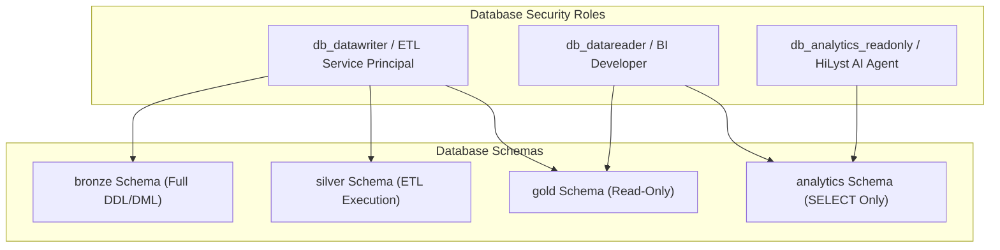

# Phase 3 — Data Quality, Security & Governance Framework

## 1. Automated Data Quality Test Suite

The data warehouse embeds an automated, stored-procedure-based Data Quality framework (`analytics.sp_Run_DataQualityTestSuite`) that executes across all Dimensions and Facts, persisting execution telemetry to `analytics.DataQualityAuditLog`.

### 1.1 Live Execution Audit Results (100% Pass Rate)

| Test Category | Test Name | Severity | Records Evaluated | Records Failed | Status | Rule Description |
| :--- | :--- | :---: | :---: | :---: | :---: | :--- |
| **Uniqueness** | `DimProduct_SKU_Unique` | CRITICAL | 11,178 | 0 | **PASS** | Asserts that every SKU in `DimProduct` is globally unique. |
| **Uniqueness** | `DimDate_DateKey_Unique` | CRITICAL | 2,193 | 0 | **PASS** | Asserts that `DateKey` in `DimDate` is unique across calendar range. |
| **Referential Integrity** | `FactSales_ProductKey_FK` | CRITICAL | 165,366 | 0 | **PASS** | Asserts 100% of sales line items resolve to a valid `DimProduct` record. |
| **Referential Integrity** | `FactSales_DateKey_FK` | CRITICAL | 165,366 | 0 | **PASS** | Asserts 100% of sales line items resolve to a valid `DimDate` record. |
| **Referential Integrity** | `FactSales_ChannelKey_FK` | CRITICAL | 165,366 | 0 | **PASS** | Asserts 100% of sales line items resolve to a valid `DimChannel` record. |
| **Referential Integrity** | `FactSales_LocationKey_FK` | HIGH | 165,366 | 0 | **PASS** | Asserts 100% of sales line items resolve to a valid `DimLocation` record. |
| **Null Checks** | `FactSales_Non_Null_Measures` | CRITICAL | 165,366 | 0 | **PASS** | Asserts zero nulls in `GrossAmount`, `NetAmount`, and `Quantity`. |
| **Range Checks** | `FactSales_Positive_Quantity` | HIGH | 165,366 | 0 | **PASS** | Asserts line item `Quantity` is never negative. |
| **Business Rules** | `FactSales_Cancelled_Consistency` | HIGH | 165,366 | 0 | **PASS** | Asserts cancelled orders always have `IsCancelled = 1`. |
| **Range Checks** | `FactInventory_Non_Negative_Stock` | MEDIUM | 9,188 | 0 | **PASS** | Asserts warehouse stock on hand is non-negative ($\ge 0$). |

---

## 2. Identified Data Quality Anomalies & Remediation Logic

### 2.1 Anomaly 1: Embedded Table Headers in Wholesale Data
- **Problem:** `International sale Report.csv` contained 1,040 rows with repeated header strings (`RATE`, `GROSS AMT`, `Stock`) from concatenated export sheets.
- **Remediation:** Filtered during Silver transformation via predicate `WHERE LTRIM(RTRIM(b.[PCS])) NOT IN ('RATE', 'GROSS AMT', 'Stock', 'PCS')` and validated numeric casting with `TRY_CAST`.

### 2.2 Anomaly 2: Null and Zero Amounts on Cancelled Orders
- **Problem:** In Amazon sales, 18,332 cancelled orders had `Qty = 0` with null or legacy amounts.
- **Remediation:** Handled via `ISNULL(TRY_CAST(b.[Amount] AS DECIMAL(18,2)), 0.00)` and assigned high-level status `OrderCategoryStatus = 'Cancelled'`, isolating cancelled orders from net realized revenue while retaining gross booking intent.

### 2.3 Anomaly 3: Geographical Casing & Trailing Whitespace
- **Problem:** State names included mixed casing (`MAHARASHTRA`, `maharashtra`, `Maharashtra`) and abbreviation codes (`MH`, `KA`, `DL`).
- **Remediation:** Standardized via uppercase `CASE` mapping in `silver.sp_Transform_AmazonSales` across all 28 states and Union Territories.

### 2.4 Anomaly 4: Float Pincodes
- **Problem:** Postal codes stored as floating numbers (e.g., `400081.0`).
- **Remediation:** Stripped `.0` suffix during Silver ETL to produce clean 6-digit postal codes (`400081`).

---

## 3. Security, Access Governance & RBAC Architecture

### 3.1 Principle of Least Privilege
1. **ETL Service Principal:** Granted write permissions exclusively on `bronze`, `silver`, and `gold`. Execution rights on `silver.sp_Transform_All_Silver` and `gold.sp_Run_Gold_ETL`.
2. **BI Analysts / Power BI:** Read-only access to `gold` and `analytics` schemas. Explicitly denied access to raw `bronze` tables.
3. **HiLyst AI Agent:** Strictly restricted to `analytics` semantic views (`SELECT ON SCHEMA::analytics`). The AI Agent cannot execute arbitrary table scans or DDL statements against `bronze`, `silver`, or `gold`.

### 3.2 PII Protection & Data Anonymization
- Customer contact numbers and direct email addresses are excluded from the warehouse schema.
- B2B customer accounts utilize hashed surrogate keys (`SourceCustomerId = CONCAT('B2B-', HASHBYTES('MD5', CustomerName))`).
- B2C retail consumers are aggregated at the geographic node level (`gold.DimLocation`), preserving spatial analytics while safeguarding individual consumer privacy.
