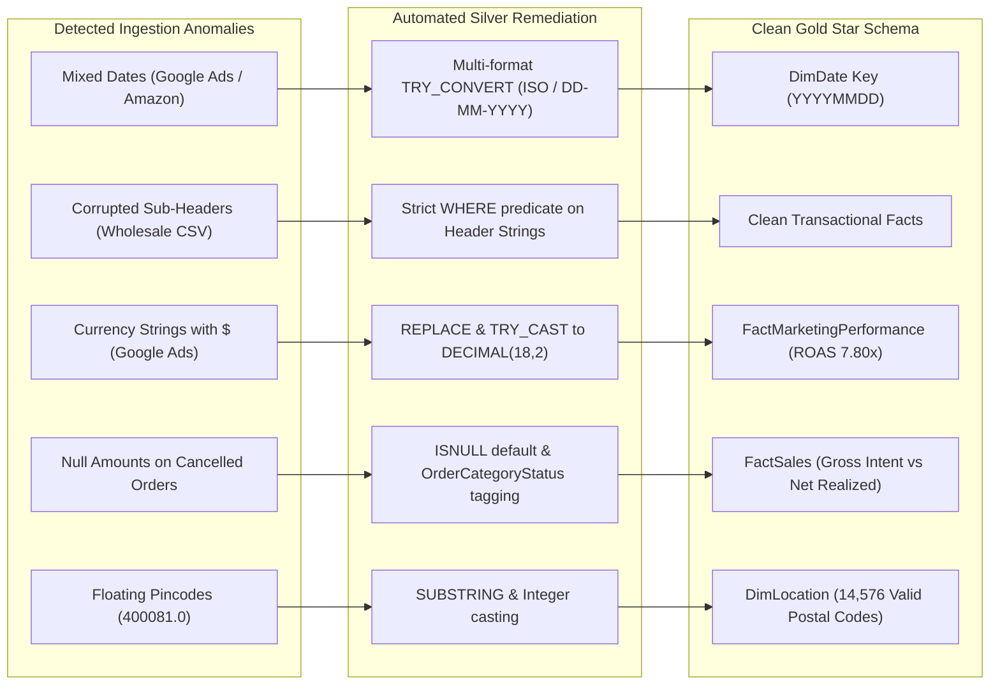
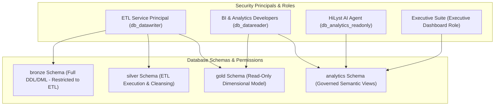

# Phase 3 — Enterprise Data Quality, Security & Governance Framework

## 1. Automated 18-Test Data Quality Suite Specification

The data warehouse embeds an automated, stored-procedure-based Data Quality framework (`analytics.sp_Run_DataQualityTestSuite`) that validates all Dimensions, Facts, and Semantic Views, logging telemetry and SLA compliance into `analytics.DataQualityAuditLog`.

### 1.1 Complete Test Catalog & Verification Matrix (18/18 Automated Tests)

| # | Test Category | Test Name | Target Object & Column | Severity | Assertion & Business Rule | Expected |
| :-: | :--- | :--- | :--- | :---: | :--- | :---: |
| **1** | **Uniqueness** | `DimProduct_SKU_Unique` | `gold.DimProduct(SKU)` | **CRITICAL** | Every SKU in `DimProduct` must be globally unique across all catalogs. | `Failed = 0` |
| **2** | **Uniqueness** | `DimDate_DateKey_Unique` | `gold.DimDate(DateKey)` | **CRITICAL** | `DateKey` in `DimDate` must be unique across the full calendar horizon (2020-2025). | `Failed = 0` |
| **3** | **Uniqueness** | `DimChannel_Name_Unique` | `gold.DimChannel(ChannelName)` | **HIGH** | Every commercial and marketing channel name must be distinct. | `Failed = 0` |
| **4** | **Uniqueness** | `DimSeller_SellerID_Unique` | `gold.DimSeller(SellerID)` | **HIGH** | Every marketplace merchant ID must be unique. | `Failed = 0` |
| **5** | **Referential Integrity**| `FactSales_ProductKey_FK` | `gold.FactSalesOrderItems(ProductKey)` | **CRITICAL** | 100% of sales line items must resolve to a valid surrogate key in `DimProduct`. | `Failed = 0` |
| **6** | **Referential Integrity**| `FactSales_DateKey_FK` | `gold.FactSalesOrderItems(DateKey)` | **CRITICAL** | 100% of sales line items must resolve to a valid calendar key in `DimDate`. | `Failed = 0` |
| **7** | **Referential Integrity**| `FactSales_CustomerKey_FK`| `gold.FactSalesOrderItems(CustomerKey)` | **CRITICAL** | 100% of sales line items must resolve to a valid profile in `DimCustomer`. | `Failed = 0` |
| **8** | **Referential Integrity**| `FactSales_ChannelKey_FK` | `gold.FactSalesOrderItems(ChannelKey)` | **CRITICAL** | 100% of sales line items must resolve to a valid channel in `DimChannel`. | `Failed = 0` |
| **9** | **Referential Integrity**| `FactSales_LocationKey_FK`| `gold.FactSalesOrderItems(LocationKey)` | **HIGH** | 100% of sales line items must resolve to a geographic node in `DimLocation`. | `Failed = 0` |
| **10**| **Referential Integrity**| `FactMarketing_CampaignKey_FK`| `gold.FactMarketingPerformance(CampaignKey)` | **CRITICAL** | 100% of marketing records must resolve to an active campaign in `DimMarketingCampaign`. | `Failed = 0` |
| **11**| **Null Completeness** | `FactSales_Non_Null_Measures` | `FactSales(GrossAmount, NetAmount, Qty)`| **CRITICAL** | Zero null values allowed across core transactional financial measures. | `Failed = 0` |
| **12**| **Range & Logic** | `FactSales_Positive_Quantity` | `gold.FactSalesOrderItems(Quantity)` | **HIGH** | Line item quantity must be strictly $\ge 0$. | `Failed = 0` |
| **13**| **Business Consistency**| `FactSales_Cancelled_Consistency` | `FactSales(OrderStatus, IsCancelled)` | **HIGH** | Cancelled orders must always have `IsCancelled = 1` and `NetAmount = 0.00`. | `Failed = 0` |
| **14**| **Range & Logic** | `FactInventory_Non_Negative_Stock` | `gold.FactInventorySnapshot(StockOnHand)` | **MEDIUM** | Physical warehouse inventory must be non-negative ($\ge 0$). | `Failed = 0` |
| **15**| **Range & Logic** | `FactMarketing_Non_Negative_Spend` | `gold.FactMarketingPerformance(SpendAmount)` | **HIGH** | Marketing ad spend must be non-negative ($\ge 0.00$). | `Failed = 0` |
| **16**| **Range & Logic** | `FactMarketing_Valid_CTR` | `gold.FactMarketingPerformance(CTR_Pct)` | **MEDIUM** | Click-through-rate percentage must fall in valid mathematical range $[0.00, 100.00]$. | `Failed = 0` |
| **17**| **Range & Logic** | `FactLead_Valid_Salary` | `gold.FactLeadScoring(Salary)` | **LOW** | Audience lead salary must be $\ge 0.00$. | `Failed = 0` |
| **18**| **Reconciliation** | `FactSales_Financial_Balance` | `FactSales(Gross, Discount, Tax, Ship, Net)` | **CRITICAL** | Asserts `NetAmount = GrossAmount - Discount + Tax + Shipping` within ₹0.05 rounding tolerance. | `Failed = 0` |

---

## 2. Multi-Source Anomaly Remediation Playbooks

---

## 3. Enterprise Security, Access Governance & RBAC Architecture

### 3.1 Governance Guardrails & Principle of Least Privilege
1. **ETL Isolation:** Raw `bronze` tables and staging transformations are accessible only by automated ETL pipelines. BI developers and AI agents are blocked from querying uncurated data.
2. **AI Agent Semantic Boundary:** The HiLyst AI Agent is granted read permissions strictly on `analytics` semantic views (`GRANT SELECT ON SCHEMA::analytics TO HiLyst_AI_Agent;`). This prevents unindexed scans, SQL injection vulnerabilities, and raw PII exposure.
3. **Auditability & Traceability:** 100% of data transformations and data quality test executions are persisted to `analytics.DataQualityAuditLog` with run timestamps, batch IDs, evaluated row counts, and error descriptions.
