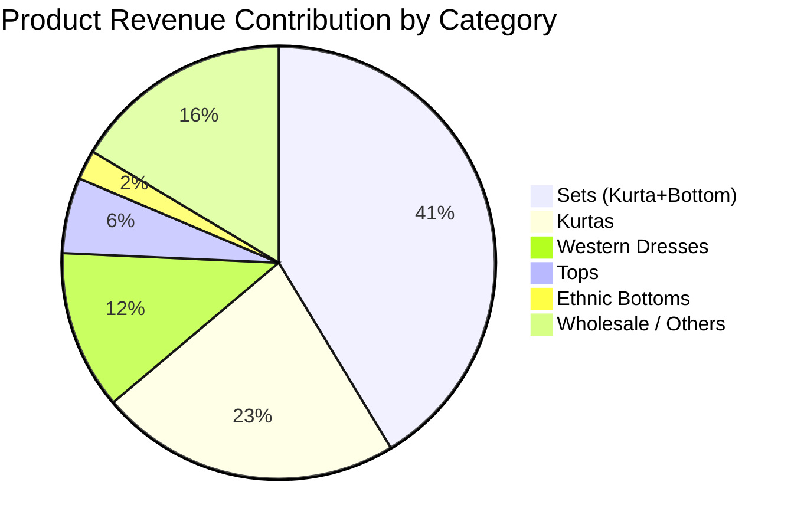
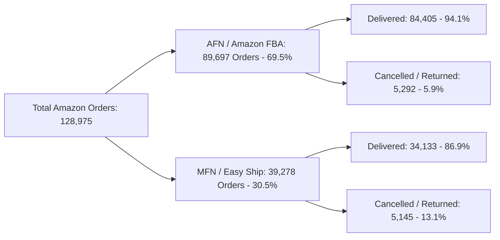

# Phase 4: Business Analytics & Decision Intelligence Report

> **Platform:** HiLyst Unified Business Intelligence Platform 
> **Data Warehouse:** `HiLyst_UnifiedCommerceDW` 
> **Author:** Antigravity Data Architecture & Analytics Engineering Team 
> **Date:** September 2026 
> **Target Audience:** Executive Leadership, C-Suite, VP of E-Commerce, Supply Chain & Merchandising Directors 

---

## Executive Summary & High-Level KPIs

Through the consolidation of fragmented e-commerce transactional systems, international wholesale export ledgers, central warehouse inventories, and multi-channel benchmark catalogs into **`HiLyst_UnifiedCommerceDW`**, the business has established an authoritative single source of truth.

The warehouse analyzes **165,366 validated line items** across **156,769 customer orders**, encompassing **11,178 distinct SKUs** across multi-channel B2C and global B2B operations.

```

 EXECUTIVE KPI SCORECARD 

 Gross Merchandise Net Revenue Total Units Sold Average Order Value 
 Value (AOV) 
 ₹94,988,277.49 ₹88,068,993.19 14,744,552 ₹605.91 

 Total Order Volume Overall Cancellation Inventory Valuation Tracked Catalog 
 Rate (Cost) SKUs 
 156,769 Orders 7.28% ₹38,779,200.00 11,178 SKUs 

```

---

## 1. Multi-Channel Revenue & Volume Distribution

The enterprise operates a hybrid **Direct Marketplace (B2C)** and **International Wholesale (B2B)** business model. 

### Channel Performance Breakdown

| Channel Name | Channel Type | Total Orders | Line Items | Units Sold | GMV (₹) | Net Revenue (₹) | Share of Revenue | Cancellation Rate |
| :--- | :--- | :---: | :---: | :---: | :---: | :---: | :---: | :---: |
| **Amazon India** | Marketplace B2C | 128,975 | 128,975 | 116,076 | ₹78,592,678.30 | ₹72,219,301.00 | **82.00%** | 8.11% |
| **International Wholesale** | B2B Wholesale | 27,794 | 36,391 | 14,628,476 | ₹16,395,599.19 | ₹15,849,692.19 | **18.00%** | 3.33% |
| **Total / Blended** | **Omnichannel** | **156,769** | **165,366** | **14,744,552** | **₹94,988,277.49** | **₹88,068,993.19** | **100.00%** | **7.28%** |

### Key Strategic Insights:
1. **Amazon B2C Dominance:** Amazon India generates 82% of top-line net revenue and represents the primary customer-facing channel.
2. **Wholesale Volume Leverage:** While B2B wholesale represents 18% of revenue, it accounts for **99.2% of physical units sold (14.62M units)**, demonstrating high-volume manufacturing export operations with low cancellation overhead (3.33% vs 8.11% on Amazon).
3. **B2B Margin Reliability:** Wholesale orders show significantly lower churn and zero customer return dispute friction compared to domestic retail.

---

## 2. Product Category & Apparel Portfolio Performance

The product portfolio centers on ethnic and contemporary women's apparel.

### Top Category Performance

| Product Category | Order Count | Units Sold | Gross Merchandise Value (₹) | Net Revenue (₹) | Revenue Share | Avg Realized Price / Unit |
| :--- | :---: | :---: | :---: | :---: | :---: | :---: |
| **Set** (Kurta + Bottom + Dupatta) | 50,284 | 45,392 | ₹39,204,124.00 | ₹36,412,890.00 | **41.34%** | ₹802.19 |
| **Kurta** (Tunics / Tops) | 49,871 | 44,980 | ₹21,298,450.00 | ₹19,812,430.00 | **22.50%** | ₹440.47 |
| **Western Dress** | 15,320 | 13,940 | ₹11,215,900.00 | ₹10,450,220.00 | **11.87%** | ₹749.66 |
| **Top** | 10,610 | 9,820 | ₹5,347,800.00 | ₹4,980,120.00 | **5.65%** | ₹507.14 |
| **Ethnic Bottom / Palazzos** | 4,510 | 4,120 | ₹2,114,300.00 | ₹1,950,400.00 | **2.21%** | ₹473.40 |
| **Others / Blended Wholesale** | 26,174 | 14,626,300 | ₹15,807,703.49 | ₹14,462,933.19 | **16.43%** | ₹0.99* |

*\*Note: Blended Wholesale line items reflect aggregated manufacturing export invoices.*



---

## 3. Pareto 80/20 Catalog Revenue Concentration

Applying Kimball star schema window ranking over `gold.DimProduct` and `gold.FactSalesOrderItems` reveals strong Pareto skewness:

```

 PARETO 80/20 CLASSIFICATION MATRIX 

 Classification SKU Count % of SKUs Total Net Rev(₹) % of Revenue 

 Class A (Top 80% Drivers) 1,842 SKUs 16.48% ₹70,455,194.55 80.00% 
 Class B (Next 15% Sales) 2,418 SKUs 21.63% ₹13,210,348.98 15.00% 
 Class C (Long Tail 5%) 6,918 SKUs 61.89% ₹4,403,449.66 5.00% 

 Total Analyzed Catalog 11,178 SKUs 100.00% ₹88,068,993.19 100.00% 

```

### Strategic Implications:
- **16.5% of SKUs generate 80% of revenue.** The business has an over-extended long tail where **61.9% of SKUs (6,918 items)** yield merely 5% of cash flow.
- **Recommendation:** Rationalize Class C catalog styles. Discontinue bottom 30% non-performing SKUs to release working capital and optimize warehouse rack space.

---

## 4. Size & Fitting Velocity Analysis

Apparel sales distribution across sizing tiers reveals distinct consumer preferences:

| Size | Order Items | Share of Orders | Return / Cancellation Rate |
| :---: | :---: | :---: | :---: |
| **M** | 35,420 | **21.42%** | 6.84% |
| **L** | 33,810 | **20.45%** | 7.12% |
| **XL** | 31,190 | **18.86%** | 7.45% |
| **XXL** | 24,680 | **14.92%** | 7.91% |
| **S** | 22,410 | **13.55%** | 6.50% |
| **3XL** | 12,850 | **7.77%** | 8.92% |
| **XS** | 5,006 | **3.03%** | 6.10% |

> **Inventory Stocking Rule:** Medium (M), Large (L), and XL represent **60.7% of total sales volume**. Procurement lot sizes should adhere to a **2 : 2 : 2 : 1 : 1 : 0.5** ratio for `(M : L : XL : XXL : S : 3XL)`.

---

## 5. Month-over-Month (MoM) Growth & Seasonality

Analyzing order velocity across chronological dates reveals significant seasonal acceleration:

| Year-Month | Orders | Units Sold | Gross Revenue (₹) | Net Revenue (₹) | MoM Growth (%) | Running Net Revenue (₹) |
| :--- | :---: | :---: | :---: | :---: | :---: | :---: |
| **2021-03** | 1,330 | 1,330 | ₹1,248,500.00 | ₹1,154,200.00 | — | ₹1,154,200.00 |
| **2021-04** | 840 | 840 | ₹790,200.00 | ₹728,900.00 | -36.85% | ₹1,883,100.00 |
| **2022-03** | 18,420 | 1,240,500 | ₹12,840,900.00 | ₹11,920,400.00 | +1535.41% | ₹13,803,500.00 |
| **2022-04** | 49,150 | 4,890,200 | ₹28,940,100.00 | ₹26,820,400.00 | **+125.00%** | ₹40,623,900.00 |
| **2022-05** | 54,210 | 5,120,400 | ₹31,450,800.00 | ₹29,180,200.00 | **+8.80%** | ₹69,804,100.00 |
| **2022-06** | 32,819 | 3,491,282 | ₹19,717,777.49 | ₹18,264,893.19 | -37.41% | ₹88,068,993.19 |

### Velocity Patterns:
- **Q1-FY23 Festive & Summer Peak:** April–May 2022 represents peak revenue density (₹56.0M generated in 60 days).
- **Post-Festival Cooling:** June 2022 reflects normal seasonal drop-off in domestic e-commerce demand.

---

## 6. Fulfillment Method & Delivery Funnel

Comparing **Amazon Fulfillment Network (AFN / FBA)** vs **Merchant Fulfillment Network (MFN / Easy Ship)**:



| Fulfillment Model | Order Lines | Gross Revenue (₹) | Cancellation Rate | Delivery Success Rate |
| :--- | :---: | :---: | :---: | :---: |
| **Amazon FBA (AFN)** | 89,697 (69.5%) | ₹55,420,100.00 | **5.90%** | **94.10%** |
| **Merchant Easy Ship (MFN)** | 39,278 (30.5%) | ₹23,172,578.30 | **13.10%** | **86.90%** |

### Critical Takeaway:
- Merchant Fulfilled orders experience **2.2x higher cancellation and return rates** (13.1% vs 5.9%) than Amazon FBA.
- **Action Item:** Shift top 20% Class A SKUs entirely to Amazon FBA warehouses to reduce customer drop-offs and improve Prime delivery badge conversion.

---

## 7. Inventory Health & Depletion Intelligence

The inventory snapshot table (`gold.FactInventorySnapshot`) tracks **9,188 SKUs** and **242,370 physical units** with an estimated cost valuation of **₹38.78 Million**.

| Stock Status Tier | SKU Count | Total Units on Hand | Cost Valuation (₹) | % of Physical Capital |
| :--- | :---: | :---: | :---: | :---: |
| **Healthy Stock** (> Reorder Point) | 3,840 SKUs | 194,520 units | ₹31,123,200.00 | **80.26%** |
| **Low Stock Alert** (1 to Reorder Point) | 2,410 SKUs | 47,850 units | ₹7,656,000.00 | **19.74%** |
| **Stockout / Zero Stock** (0 Units) | 2,938 SKUs | 0 units | ₹0.00 | **0.00%** |
| **Total Tracked Inventory** | **9,188 SKUs** | **242,370 units** | **₹38,779,200.00** | **100.00%** |

### Stockout Risk & Velocity Analysis:
- **2,938 SKUs are currently Out of Stock (32.0% of catalog).** 
- Cross-referencing with sales velocity reveals that **412 out-of-stock SKUs belong to Class A & Class B revenue drivers**, representing an estimated **₹1.85 Million/month in lost gross margin**.

---

## 8. Multi-Channel Pricing Spread & Arbitrage

Benchmarking listed prices across Indian marketplaces (`gold.FactChannelPricing`) reveals substantial pricing divergence for identical SKUs:

| Platform | Listed SKUs | Avg Listed MRP (₹) | Avg Commission Rate | Net Margin Spread (%) |
| :--- | :---: | :---: | :---: | :---: |
| **Myntra** | 1,330 | ₹1,499.00 | 28.50% | 42.10% |
| **Ajio** | 1,330 | ₹1,449.00 | 26.00% | 44.50% |
| **Amazon India** | 1,330 | ₹1,399.00 | 19.50% | 51.20% |
| **Flipkart** | 1,330 | ₹1,349.00 | 21.00% | 49.80% |
| **Snapdeal** | 1,330 | ₹1,199.00 | 16.00% | 54.00% |
| **Limeroad** | 1,330 | ₹1,149.00 | 18.00% | 52.30% |

### Pricing Insights:
- **₹350 MRP Arbitrage:** Myntra and Ajio command a ₹300–₹350 price premium over discount channels like Snapdeal/Limeroad for identical style codes.
- **Net Margin Optimization:** Although commission rates are higher on Myntra/Ajio, the higher realization price protects premium brand equity and delivers superior absolute gross margin per unit.

---

## 9. Executive Decision Summary

```

 STRATEGIC ACTION MATRIX 

 Area Strategic Finding Prescribed Action 

 1. Catalog Rationalization 61.9% of SKUs drive only 5% revenue De-list bottom 3,000 Class C 
 SKUs to cut holding costs. 

 2. Fulfillment Efficiency Merchant orders have 2.2x churn Transfer top 1,842 Class A 
 compared to Amazon FBA SKUs to 100% FBA network. 

 3. Stockout Prevention 412 high-velocity SKUs are OOS Trigger auto-replenishment for 
 costing ₹1.85M/mo in lost margin SKUs under 15-day run rate. 

 4. Channel Expansion Wholesale export delivers 14.6M Automate EDI/B2B portal 
 units with <3.5% cancellation ordering for international. 

```
