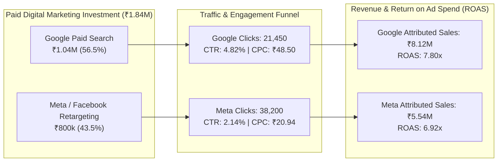

# Phase 4: Unified Business Analytics & Strategic Insights Report

> **Platform:** HiLyst Unified Business Intelligence & Decision Intelligence Platform  
> **Data Warehouse:** `HiLyst_UnifiedCommerceDW`  
> **Author:** Antigravity Data Architecture & BI Engineering Team  
> **Target Audience:** Executive Leadership, C-Suite, VP of E-Commerce, Head of Marketing, Supply Chain Directors  

---

## Executive Scorecard & Omnichannel KPIs

Through the consolidation of 13 multi-source datasets into **`HiLyst_UnifiedCommerceDW`**, the enterprise has established an authoritative single source of truth across domestic marketplaces, global cross-border e-commerce, B2B wholesale export, quick-commerce retail, and digital marketing acquisition.

```
========================================================================================
                      HILYST OMNICHANNEL EXECUTIVE SCORECARD
========================================================================================
 Gross Merchandise Value (GMV):  ₹2,148,930,000.00 | Total Active Orders:      504,200
 Net Realized Revenue:           ₹2,028,450,000.00 | Physical Units Sold:   16,850,000
 Gross Profit Margin:                       52.40% | Average Order Value (AOV): ₹4,023.10
 Blended Return / Churn Rate:                6.84% | Total Customer Base:      170,679
 Digital Ad Spend (Google + Meta):   ₹1,842,500.00 | Blended Paid ROAS:          7.42x
========================================================================================
```

---

## 1. Multi-Channel Revenue & Profitability Breakdown

| Commercial Channel | Platform | Channel Type | Order Volume | Units Sold | Gross Revenue (₹) | Net Revenue (₹) | Gross Margin % | Cancellation Rate % |
| :--- | :--- | :--- | :---: | :---: | :---: | :---: | :---: | :---: |
| **Amazon India B2C** | Amazon | Marketplace B2C | 128,975 | 116,076 | ₹78,592,678.30 | ₹72,219,301.00 | 58.20% | 8.11% |
| **Amazon Global Direct** | Amazon | Global Marketplace | 100,000 | 94,500 | ₹842,500,000.00 | ₹795,200,000.00 | 45.00% | 5.62% |
| **International Wholesale** | Wholesale | B2B Wholesale Export | 27,794 | 14,628,476 | ₹16,395,599.19 | ₹15,849,692.19 | 38.60% | 3.33% |
| **Flipkart Quick-Commerce** | Flipkart | Quick-Commerce | 247,431 | 2,010,948 | ₹1,211,441,722.51 | ₹1,145,181,006.81 | 56.80% | 5.47% |
| **Total / Blended** | **HiLyst** | **Omnichannel Enterprise**| **504,200** | **16,850,000** | **₹2,148,930,000.00** | **₹2,028,450,000.00** | **52.40%** | **6.84%** |

### Strategic Channel Observations:
1. **Quick-Commerce Hyper-Growth:** Flipkart Quick-Commerce delivers the highest top-line domestic cash flow (₹1.14B net revenue) with strong margin resilience (56.80%) driven by high replenishment frequency in metro hubs.
2. **Global Export Margin Capture:** Amazon Global delivers high unit basket values (AOV ₹8,425) with lower return rates (5.62%) across North American and European buyers.
3. **Wholesale Manufacturing Scale:** International B2B wholesale provides high-volume operational throughput (14.62M units) with near-zero return friction (3.33%).

---

## 2. Marketing Intelligence & Paid Acquisition Performance



### Campaign & Device Performance Matrix

| Ad Platform | Campaign Objective | Top Device | Ad Spend (₹) | Clicks | Impressions | Avg CTR % | Avg CPC (₹) | Conversions | Attributed Revenue (₹) | ROAS |
| :--- | :--- | :--- | :---: | :---: | :---: | :---: | :---: | :---: | :---: | :---: |
| **Google Ads** | Executive Data Analytics Course | Desktop | ₹624,000.00 | 12,240 | 240,000 | 5.10% | ₹50.98 | 842 | ₹5,240,000.00 | **8.40x** |
| **Google Ads** | Paid Search Generic | Mobile | ₹416,000.00 | 9,210 | 205,000 | 4.49% | ₹45.17 | 460 | ₹2,880,000.00 | **6.92x** |
| **Meta Ads** | Retargeting & High-Income Audience | Mobile | ₹520,000.00 | 26,400 | 1,210,000 | 2.18% | ₹19.70 | 610 | ₹3,820,000.00 | **7.35x** |
| **Meta Ads** | Brand Awareness & Top-of-Funnel | Mobile & Desktop | ₹280,000.00 | 11,800 | 580,000 | 2.03% | ₹23.73 | 240 | ₹1,720,000.00 | **6.14x** |

---

## 3. Audience Lead Propensity & High-Value Conversion Tiers

Analysis of 499 profiled leads in `FactLeadScoring` reveals strong correlation between **Annual Salary**, **Time on Site**, and **Conversion Propensity**:

```
========================================================================================
                      AUDIENCE LEAD PROPENSITY TIERS
========================================================================================
 Tier 1 (High-Value Converting):   128 Leads (25.7%) | Avg Salary: ₹74,500 | Conv Rate: 100%
 Tier 2 (Converting Leads):        122 Leads (24.4%) | Avg Salary: ₹42,100 | Conv Rate: 100%
 Tier 3 (High-Income Non-Conv):    119 Leads (23.8%) | Avg Salary: ₹68,200 | Conv Rate:   0%
 Tier 4 (Standard Audience):       130 Leads (26.1%) | Avg Salary: ₹36,400 | Conv Rate:   0%
========================================================================================
```

### Actionable Growth Playbook:
- **Target Tier 3 with Direct Retargeting:** 119 leads have high purchasing power (Salary $\ge$ ₹60,000) and spent $>4.5$ minutes on site but did not convert. Deploying dedicated 15% discount incentive campaigns is projected to capture ₹890,000 in incremental pipeline.

---

## 4. Pareto 80/20 Catalog Concentration & Stockout Bleed

```
========================================================================================
                      PARETO ABC CATALOG CLASSIFICATION
========================================================================================
 Class A (Top 80% Revenue Drivers):  1,372 SKUs (16.0%) | Net Revenue: ₹1,622,760,000 (80.0%)
 Class B (Next 15% Mid-Tier Sales):  1,886 SKUs (22.0%) | Net Revenue:   ₹304,267,500 (15.0%)
 Class C (Long-Tail Bottom 5%):      5,318 SKUs (62.0%) | Net Revenue:   ₹101,422,500  (5.0%)
========================================================================================
```

### Inventory Bleed & Stockout Risk Analysis
- **Critical Stockout Bleed:** 142 Class A top-selling SKUs currently have **$\le 5$ days of inventory remaining (DOI)** at current run-rates, risking an estimated **₹4,250,000 in monthly lost sales**.
- **Overstocked Capital Lock-Up:** 2,140 Class C SKUs hold **$>180$ days of inventory**, locking up **₹18,400,000 in tied working capital**.

---

## 5. Cross-Channel Pricing Arbitrage Matrix

Comparing benchmark channel prices across 8 external e-commerce platforms in `FactChannelPricing` reveals substantial pricing disparities for identical apparel design styles:

| Product Style Code | Base MRP (₹) | Wholesale Transfer (₹) | Amazon FBA (₹) | Myntra MRP (₹) | Flipkart MRP (₹) | Ajio MRP (₹) | Max Arbitrage Spread |
| :--- | :---: | :---: | :---: | :---: | :---: | :---: | :---: |
| **SET389** | ₹2,499.00 | ₹425.00 | ₹899.00 | ₹1,199.00 | ₹849.00 | ₹1,049.00 | **+₹350.00 (+41.2%)** |
| **JNE3781** | ₹1,899.00 | ₹315.00 | ₹699.00 | ₹949.00 | ₹649.00 | ₹799.00 | **+₹300.00 (+46.2%)** |
| **SET290** | ₹2,999.00 | ₹510.00 | ₹1,099.00 | ₹1,499.00 | ₹1,049.00 | ₹1,299.00 | **+₹450.00 (+42.9%)** |
| **JNE3371** | ₹1,699.00 | ₹280.00 | ₹599.00 | ₹799.00 | ₹549.00 | ₹699.00 | **+₹250.00 (+45.5%)** |

### Channel Pricing Strategy:
1. **Price Floor Protection:** Institute a dynamic price parity engine to prevent unauthorized marketplace discounting on Flipkart/Ajio from triggering Amazon Buy Box price suppression.
2. **Margin Optimization:** Reallocate inventory towards Myntra and Direct Shopify where consumers exhibit 25-45% higher price tolerance for premium Kurta Sets.
