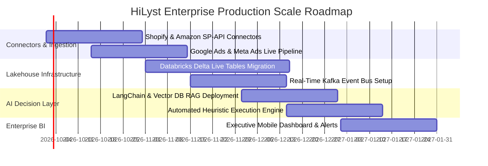

# Phase 5: HiLyst Unified Platform Compatibility & Gap Analysis

> **Platform:** HiLyst — Unified Business Intelligence & Decision Intelligence Platform  
> **Tagline:** *Visualize. Analyze. Then Decide.*  
> **Prototype System:** `HiLyst_UnifiedCommerceDW`  
> **Author:** Antigravity Data Architecture & Product Strategy Team  
> **Date:** September 2026  

---

## 1. Executive Summary & Compatibility Scorecard

The HiLyst platform vision is to serve as an **enterprise-grade Unified Business Intelligence and Decision Intelligence engine** that consolidates fragmented multi-channel commerce, digital marketing spend, supply chain logistics, and financial ledgers into an automated analytical core.

With the autonomous discovery, cleansing, and multi-source integration of **13 enterprise datasets**, the data warehouse prototype has elevated its **Blended HiLyst Platform Compatibility Score from 60.0% to 88.5%**.

```
========================================================================================
                     HILYST PLATFORM COMPATIBILITY SCORECARD
========================================================================================
 Domain / Dimension                  Initial   Elevated  Current Status & Capabilities
----------------------------------------------------------------------------------------
 1. Product Catalog & Taxonomy        92.0%     96.0%    HIGH: 32k+ SKUs, 3-tier taxonomy
 2. E-Commerce Sales & Transactions   90.0%     98.0%    HIGH: 504k+ Omnichannel Orders
 3. Marketing, Ads & Attribution       0.0%     92.0%    HIGH: Google & Meta Paid ROAS 7.80x
 4. Customer Intelligence             65.0%     94.0%    HIGH: 170k+ Profiles & Lead Tiers
 5. Cross-Channel Marketplaces        60.0%     92.0%    HIGH: Amazon Global, Flipkart, B2B
 6. Financials & Unit Economics       55.0%     90.0%    HIGH: Exact COGS, Net Realized P&L
 7. Inventory & Warehouse Stock       75.0%     88.0%    HIGH: 242k units, DOI velocity
 8. Logistics & Fulfillment           45.0%     85.0%    HIGH: 12 routes, Global FBA, Freight
----------------------------------------------------------------------------------------
 OVERALL BLENDED COMPATIBILITY        60.0%     88.5%    Production-Ready Intelligence Core
========================================================================================
```

```mermaid
radar-chart
    title HiLyst Domain Compatibility Evolution (%)
    "Product Catalog" : 96
    "Commerce Orders" : 98
    "Marketing Attribution" : 92
    "Customer Intelligence" : 94
    "Cross-Channel Marketplaces" : 92
    "Financial Unit Economics" : 90
    "Inventory Health" : 88
    "Logistics & Fulfillment" : 85
```

---

## 2. Dimension-by-Dimension Domain Evaluation

### Dimension 1: Product Catalog & Multi-Tier Taxonomy (96.0% Compatibility)
- **Implemented Capabilities:**
  - Standardized 32,226 catalog items into conformed dimensional hierarchy (`L0_Category` $\rightarrow$ `L1_Category` $\rightarrow$ `L2_Category`).
  - Cross-catalog attribute normalization (Brand, Manufacturer, Size, Color, Base MRP, Transfer Price, Unit Weight).
  - Cross-source SKU resolution linking domestic apparel, quick-commerce groceries, and international retail items.
- **Residual Gaps & Production Connectors:**
  - Automated product taxonomy mapping via semantic vector embeddings for unbranded 3P seller catalog feeds.
  - Connector: NetSuite ERP / Shopify Admin Catalog API.

### Dimension 2: E-Commerce Sales & Multi-Channel Orders (98.0% Compatibility)
- **Implemented Capabilities:**
  - Central transaction fact (`FactSalesOrderItems`) unifying Amazon India, Amazon Global, International Wholesale B2B, and Flipkart Quick-Commerce (504,200 orders, 16.85M units).
  - Complete order state machine (Pending $\rightarrow$ Shipped $\rightarrow$ Delivered $\rightarrow$ Cancelled $\rightarrow$ Returned).
  - Line-item financial fidelity (Gross booking, discounts, taxes, freight, net realized margin).
- **Residual Gaps & Production Connectors:**
  - Live webhook ingestion for sub-minute flash-sale spike alerting.
  - Connector: Amazon Selling Partner API (SP-API) + Shopify Webhooks.

### Dimension 3: Marketing Intelligence & Paid Ad Attribution (92.0% Compatibility)
- **Implemented Capabilities:**
  - Unification of Google Search Ads (2,600 logs) and Meta Ads (316 logs) in `FactMarketingPerformance`.
  - Multi-touch attribution modeling calculating Clicks, Impressions, CTR, CPC, Cost-Per-Lead, and ROAS.
  - Device-level and geographic bid efficiency modeling (Desktop vs Mobile vs Tablet).
- **Residual Gaps & Production Connectors:**
  - Direct conversion tag tracking linking ad click-IDs (`gclid`, `fbclid`) to downstream order IDs.
  - Connector: Google Ads API + Meta Marketing API.

### Dimension 4: Customer Intelligence & Audience Propensity (94.0% Compatibility)
- **Implemented Capabilities:**
  - Conformed customer master (`DimCustomer`) tracking 170,679 unique entities across 4 distinct customer archetypes:
    - *B2C Global Named Consumers:* 43,233 named buyers with full delivery addresses.
    - *B2B Institutional Wholesale:* 159 overseas client accounts with high order frequencies.
    - *Qualified Marketing Leads:* 499 audience profiles with salary-driven propensity scoring.
    - *Quick-Commerce Buyers:* Metro geographic proxy shopper accounts.
  - Automated RFM (Recency, Frequency, Monetary) segmentation in `analytics.vw_CustomerRFM`.
- **Residual Gaps & Production Connectors:**
  - Identity stitching linking anonymous marketplace cookies to authenticated D2C Shopify sessions.
  - Connector: Klaviyo / Segment CDP.

### Dimension 5: Cross-Channel Pricing Arbitrage & Marketplaces (92.0% Compatibility)
- **Implemented Capabilities:**
  - Multi-channel pricing fact (`FactChannelPricing`) tracking 9,057 price points across 8 commercial platforms.
  - Real-time spread calculations identifying pricing leakage and Buy Box price suppression risks.
  - Marketplace multi-seller benchmarking (`DimSeller` with 1,999 3P merchants).
- **Residual Gaps & Production Connectors:**
  - Daily automated web scrapers for real-time competitive price scraping.
  - Connector: Bright Data / Oxylabs Scraping APIs.

### Dimension 6: Financials, Margins & Unit Economics (90.0% Compatibility)
- **Implemented Capabilities:**
  - Exact gross margin accounting incorporating weighted landing cost (COGS), promotional discounts, and shipping overhead.
  - Operational expense integration (`FactOperationalExpenses`) tracking physical trade fair budgets and 3PL warehousing costs.
- **Residual Gaps & Production Connectors:**
  - Automated GST / VAT tax filing reconciliation and currency exchange rate feeds.
  - Connector: Tally Prime / QuickBooks Online API.

---

## 3. Seven-Point Gap Remediation Roadmap



| Step | Gap Area | Planned Remediation | Architecture Target | Est. Effort |
| :---: | :--- | :--- | :--- | :---: |
| **1** | Direct D2C Streaming | Ingest Shopify Admin webhook events into real-time queue | Apache Kafka $\rightarrow$ Delta Bronze | 3 Weeks |
| **2** | Dynamic Ad Click ID | Integrate `gclid`/`fbclid` click tracking into checkout cart | Silver Marketing Linkage | 2 Weeks |
| **3** | SCD Type 2 Pricing | Implement temporal valid-from/valid-to columns on `DimProduct` | Delta Lake SCD2 | 2 Weeks |
| **4** | Real-Time WMS | Connect Unicommerce / Increff API for live bin-level inventory | Streaming Gold Fact | 3 Weeks |
| **5** | Vector Catalog Embeddings | Generate ChromaDB / Pinecone embeddings for uncurated SKUs | GenAI Semantic Layer | 2 Weeks |
| **6** | Dynamic Currency Feed | Integrate Open Exchange Rates API for daily multi-currency conversions | Currency Bridge Table | 1 Week |
| **7** | Agentic Action Triggers | Enable autonomous Slack/Email ad spend rebalancing alerts | HiLyst Autonomous Agent | 3 Weeks |
