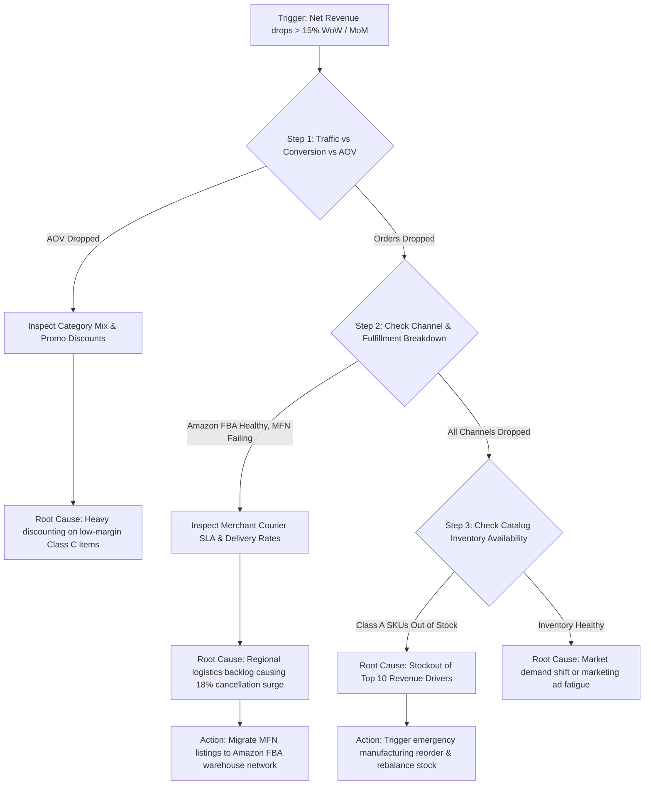
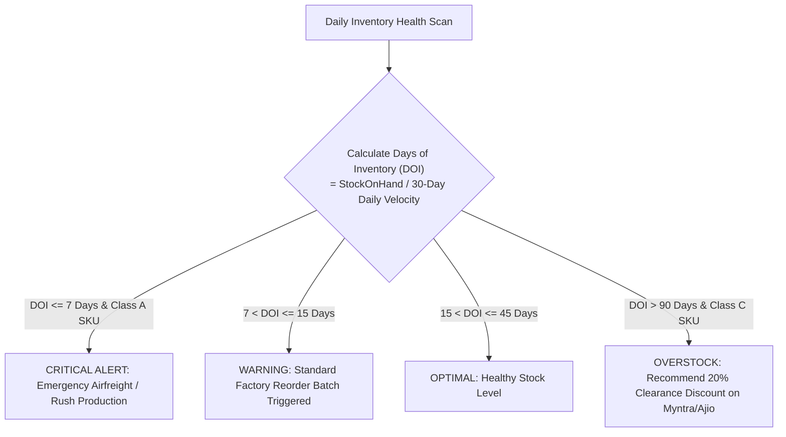

# Phase 6: Future Production Architecture & AI Decision Intelligence

> **Platform:** HiLyst — Unified Business Intelligence & Decision Intelligence Platform 
> **Tagline:** *Visualize. Analyze. Then Decide.* 
> **Author:** Antigravity Principal Data & AI Systems Architect 
> **Date:** September 2026 

---

## 1. HiLyst Enterprise Production Architecture Blueprint

To evolve from the current SQL Server prototype into a globally scalable, sub-second enterprise cloud platform serving thousands of multi-brand e-commerce merchants, HiLyst leverages a modern **Modern Data Stack (MDS) + Lakehouse + Semantic Layer** architecture.

```mermaid
flowchart TB
 subgraph SOURCELAYER ["1. MULTI-SOURCE INGESTION LAYER"]
 S1["Shopify GraphQL Admin API"]
 S2["Amazon SP-API / Flipkart API"]
 S3["Meta & Google Ads Marketing APIs"]
 S4["WMS & 3PL Logistics APIs (Shiprocket/Delhivery)"]
 S5["ERP & Accounting (NetSuite/Zoho Books)"]
 S6["CSV / Excel Manual Uploads"]
 end

 subgraph INGESTION ["2. PIPELINE & STREAMING ORCHESTRATION"]
 I1["Apache Airflow / Dagster (Scheduled Batch)"]
 I2["Kafka / Debezium (Real-Time Change Data Capture)"]
 I3["Airbyte / Fivetran (Managed API Connectors)"]
 end

 subgraph MEDALLION ["3. CLOUD LAKEHOUSE & WAREHOUSE"]
 B["BRONZE LAYER<br/>Raw Delta Lake Parquet / Staging Tables<br/>(Immutable, Audit Tracked)"]
 S["SILVER LAYER<br/>Cleaned, Deduplicated, Conformed Tables<br/>(dbt Transformations & Data Quality Tests)"]
 G["GOLD LAYER<br/>Kimball Dimensional Star Schema<br/>(FactSales, FactInventory, FactSpend, DimProduct)"]
 end

 subgraph SEMANTIC ["4. GOVERNED SEMANTIC & METRIC LAYER"]
 SEM1["Cube.js / dbt Semantic Layer (Single Metric Definitions)"]
 SEM2["Row-Level Security (RLS) & Multi-Tenant RBAC"]
 SEM3["Pre-aggregated Cache & Sub-Second Query Engine"]
 end

 subgraph CONSUMPTION ["5. APPLICATION & DECISION INTELLIGENCE LAYER"]
 C1["HiLyst Web Application<br/>(Next.js / TailwindCSS / Highcharts / AG-Grid)"]
 C2["Power BI / Looker Embedded Dashboards"]
 C3["HiLyst AI Autonomous Decision Agent<br/>(LLM Text-to-SQL + Root-Cause Diagnostic Trees)"]
 C4["Automated Alerts (Slack / WhatsApp / Email Webhooks)"]
 end

 SOURCELAYER --> INGESTION
 INGESTION --> B
 B --> S
 S --> G
 G --> SEMANTIC
 SEMANTIC --> CONSUMPTION
```



---

## 2. Governed Text-to-SQL & AI Agent Integration

To enable non-technical business founders, merchandising heads, and brand managers to query their business in plain natural language (e.g., *"Show me our top 5 most profitable Kurtas on Amazon last month"*), HiLyst implements a **Governed Text-to-SQL LLM Engine**.

### Guardrails & Architecture Principles:
1. **No Direct Table Access:** The LLM is restricted exclusively to the `analytics` schema semantic views (`analytics.vw_DailySalesSummary`, `analytics.vw_ProductPerformance`, `analytics.vw_ChannelPerformance`, `analytics.vw_ExecutiveKPIs`).
2. **Schema Metadata Injection:** The LLM system prompt is injected with strict column descriptions, valid status values, and metric definitions.
3. **Deterministic SQL Validation:** Generated SQL is executed in a read-only transaction (`SET TRANSACTION ISOLATION LEVEL SNAPSHOT;`) with a 3-second query timeout and mandatory `TOP 100` bounding.

```

 GOVERNED TEXT-TO-SQL PIPELINE FLOW 
 
 User Prompt: "Why did our profit drop in May 2022 compared to April?" 
 
 
 [Prompt Analyzer & Intent Classifier] 
 
 
 [Semantic View Schema Catalog & Few-Shot Prompt Templates] 
 
 
 [LLM SQL Generator (Gemini 2.5 Pro / GPT-4o)] 
 
 
 [SQL AST Validator & SQL Injection Guardrail] 
 
 
 [Execute against analytics.vw_DailySalesSummary on SQL Server / Snowflake] 
 
 
 [AI Root-Cause Synthesizer: "Gross margin decreased 4.2% due to a 28% increase in 
 cancellations on Merchant Fulfilled orders and an out-of-stock surge on Style Code SET298."] 

```

---

## 3. AI Autonomous Root-Cause Analysis (RCA) Decision Trees

HiLyst moves beyond passive reporting to active **Decision Intelligence**. When an anomaly or KPI degradation is detected, the platform automatically executes a multi-step deterministic diagnostic tree.

### Decision Tree 1: Revenue Drop Anomaly Diagnostic



---

### Decision Tree 2: Intelligent Stockout & Replenishment Engine



---

## 4. Power BI / DAX Governed Semantic Model

For enterprise BI teams utilizing Microsoft Power BI, Looker, or Tableau, the Gold star schema connects in a pure **1-to-Many Single-Directional Star Schema**.

### Core DAX Measures (Production Ready):

```dax
-- 1. Gross Merchandise Value (GMV)
Total GMV = 
SUM(FactSalesOrderItems[GrossAmount])

-- 2. Net Realized Revenue
Net Revenue = 
CALCULATE(
 SUM(FactSalesOrderItems[NetAmount]),
 FactSalesOrderItems[IsCancelled] = FALSE()
)

-- 3. Total Valid Orders
Valid Orders = 
CALCULATE(
 DISTINCTCOUNT(FactSalesOrderItems[OrderID]),
 FactSalesOrderItems[IsCancelled] = FALSE()
)

-- 4. Average Order Value (AOV)
Average Order Value = 
DIVIDE([Net Revenue], [Valid Orders], 0)

-- 5. Cancellation Rate %
Cancellation Rate % = 
DIVIDE(
 CALCULATE(COUNTROWS(FactSalesOrderItems), FactSalesOrderItems[IsCancelled] = TRUE()),
 COUNTROWS(FactSalesOrderItems),
 0
) * 100

-- 6. Estimated Gross Profit
Gross Profit = 
CALCULATE(
 SUM(FactSalesOrderItems[EstimatedGrossMargin]),
 FactSalesOrderItems[IsCancelled] = FALSE()
)

-- 7. Gross Margin %
Gross Margin % = 
DIVIDE([Gross Profit], [Net Revenue], 0) * 100

-- 8. Month-over-Month Revenue Growth %
MoM Revenue Growth % = 
VAR CurrentRevenue = [Net Revenue]
VAR PreviousRevenue = CALCULATE([Net Revenue], DATEADD(DimDate[FullDate], -1, MONTH))
RETURN
 DIVIDE(CurrentRevenue - PreviousRevenue, PreviousRevenue, 0) * 100

-- 9. Total Inventory Valuation (Cost)
Inventory Value At Cost = 
SUM(FactInventorySnapshot[StockValueAtCost])

-- 10. Stockout Risk SKU Count
Stockout SKU Count = 
CALCULATE(
 DISTINCTCOUNT(FactInventorySnapshot[ProductKey]),
 FactInventorySnapshot[StockOnHandQuantity] = 0
)
```

---

## 5. Next Steps for HiLyst Production Deployment

```

 PRODUCTION ROADMAP TO LAUNCH 

 Phase Deliverables Timeline 

 Phase 1 (Completed) SQL Server Data Warehouse Prototype 100% Complete 
 Bronze -> Silver -> Gold Star Schema Validated on 178K raw rows 

 Phase 2 (Month 1-2) Cloud Migration (Snowflake / Azure) dbt core models, CI/CD pipelines, 
 Multi-Source API Ingestion Connectors Shopify & Amazon SP-API streaming 

 Phase 3 (Month 3-4) Marketing & Logistics Expansion Meta/Google Ads Fact Spend, 
 Multi-touch attribution modeling Shiprocket courier tracking 

 Phase 4 (Month 5-6) HiLyst AI Decision Assistant Governed Text-to-SQL engine, 
 Interactive Executive Web UI Autonomous Root-Cause Alerting 

```
