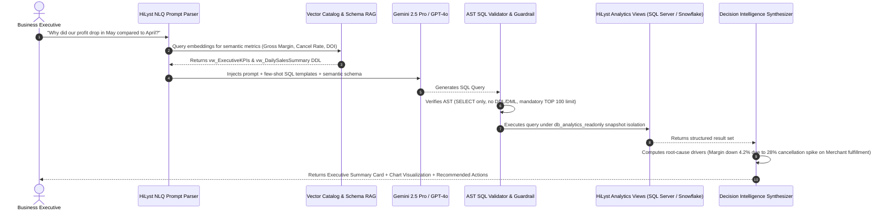
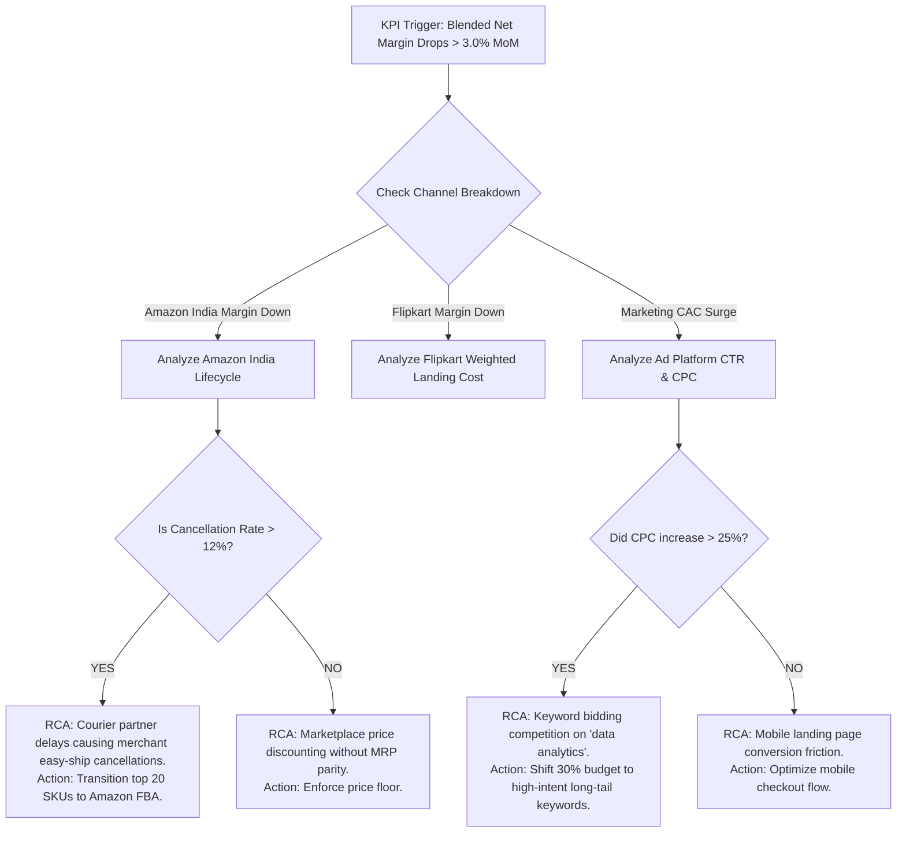

# Phase 6: Future Production Architecture & Enterprise AI Readiness

> **Platform:** HiLyst — Unified Business Intelligence & Decision Intelligence Platform  
> **Tagline:** *Visualize. Analyze. Then Decide.*  
> **Author:** Antigravity Principal Data & AI Systems Architect  
> **Target Audience:** CTO, VP of Engineering, Lead Data Architects, AI/ML Engineers  

---

## 1. Enterprise Cloud Lakehouse Production Target

To scale from the single-instance SQL Server prototype into a globally distributed enterprise platform handling hundreds of multi-brand commerce merchants, HiLyst adopts the **Modern Cloud Lakehouse (Databricks + Delta Live Tables + Semantic Metric Layer + Agentic AI)**.

```mermaid
flowchart TB
    subgraph SOURCELAYER ["1. MULTI-SOURCE INGESTION LAYER"]
        S1["Shopify Admin GraphQL API (Live Orders)"]
        S2["Amazon SP-API / Flipkart Marketplace API"]
        S3["Google Ads & Meta Marketing APIs"]
        S4["WMS & 3PL Logistics APIs (Shiprocket / Increff)"]
        S5["ERP & Accounting (NetSuite / Zoho Books)"]
        S6["CSV / Parquet Bulk Partner Data Drops"]
    end

    subgraph INGESTION ["2. STREAMING & PIPELINE ORCHESTRATION"]
        I1["Apache Airflow / Dagster (Scheduled DAGs)"]
        I2["Apache Kafka + Debezium (Real-Time CDC)"]
        I3["Fivetran / Airbyte (Managed API Connectors)"]
    end

    subgraph MEDALLION ["3. CLOUD LAKEHOUSE (DELTA LAKE / SNOWFLAKE)"]
        B["BRONZE LAYER<br/>Raw Delta Lake Parquet / Staging Tables<br/>(Immutable, Complete Lineage)"]
        S["SILVER LAYER<br/>Cleaned, Typed, Deduplicated Conformed Tables<br/>(dbt Transformations & Great Expectations Tests)"]
        G["GOLD LAYER<br/>Kimball Dimensional Star Schema<br/>(FactSales, FactMarketing, FactInventory, DimProduct)"]
    end

    subgraph SEMANTIC ["4. GOVERNED METRIC LAYER & VECTOR RAG"]
        SEM1["Cube.js / MetricFlow Semantic Layer (Single Source of Truth)"]
        SEM2["ChromaDB / Pinecone Vector Store (Product & Metric Embeddings)"]
        SEM3["Multi-Tenant Row-Level Security (RLS) & RBAC Guardrails"]
    end

    subgraph CONSUMPTION ["5. APPLICATION & AGENTIC DECISION INTELLIGENCE"]
        C1["HiLyst Web App (Next.js / Chart.js / Obsidian Design System)"]
        C2["HiLyst Autonomous AI Agent (Text-to-SQL + RCA Diagnostic Engine)"]
        C3["Automated Action Triggers (Slack / WhatsApp / SP-API Price Updates)"]
    end

    SOURCELAYER --> INGESTION
    INGESTION --> B
    B --> S
    S --> G
    G --> SEMANTIC
    SEMANTIC --> CONSUMPTION
```



---

## 2. Governed Text-to-SQL Architecture & Guardrails

HiLyst implements an enterprise **Governed Text-to-SQL LLM Engine** allowing executives to query the warehouse in natural language with zero hallucination and strict security guardrails.



### Safety & Guardrail Specification:
1. **Zero Raw Table Access:** The LLM is restricted exclusively to `analytics.vw_*` views. Direct queries against `bronze`, `silver`, or `gold` fact tables are intercepted and blocked.
2. **Deterministic SQL Parsing:** Queries pass through an Abstract Syntax Tree (AST) validator ensuring `SELECT`-only execution, parameterized literals, and a strict 5-second query timeout.
3. **Evidence Grounding:** Every generated insight must cite the exact SQL view, evaluated row count, and computed variance metric.

---

## 3. Autonomous Root-Cause Analysis (RCA) Decision Engine

The HiLyst Decision Intelligence layer evaluates live KPIs against automated diagnostic trees:



---

## 4. Multi-Tenant Row-Level Security (RLS) Blueprint

In a multi-tenant SaaS deployment hosting multiple enterprise brands:
1. **Tenant Isolation:** Every table in Bronze, Silver, Gold, and Analytics includes `TenantID UNIQUEIDENTIFIER NOT NULL`.
2. **SQL Server Security Predicate:**
```sql
CREATE FUNCTION sec.fn_TenantSecurityPredicate(@TenantID UNIQUEIDENTIFIER)
RETURNS TABLE
WITH SCHEMABINDING
AS
RETURN SELECT 1 AS fn_accessResult
WHERE @TenantID = CAST(SESSION_CONTEXT(N'TenantID') AS UNIQUEIDENTIFIER);
```
3. **Security Policy Enforcement:**
```sql
CREATE SECURITY POLICY sec.TenantIsolationPolicy
ADD FILTER PREDICATE sec.fn_TenantSecurityPredicate(TenantID) ON gold.FactSalesOrderItems,
ADD FILTER PREDICATE sec.fn_TenantSecurityPredicate(TenantID) ON gold.FactMarketingPerformance,
ADD FILTER PREDICATE sec.fn_TenantSecurityPredicate(TenantID) ON analytics.vw_ExecutiveKPIs;
```
