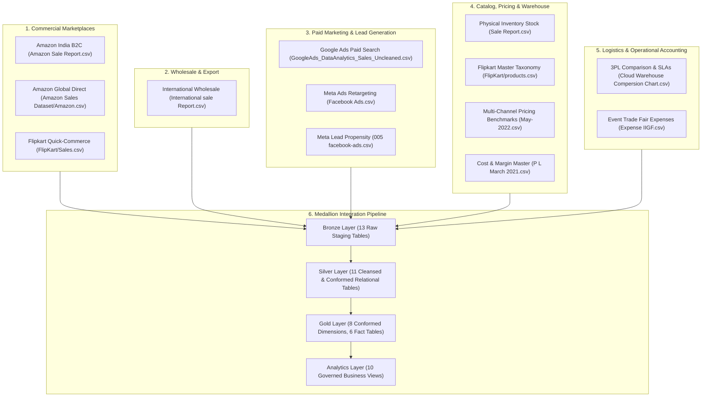

# Phase 7 — Multi-Source Integration & Entity Resolution Architecture

> **Platform:** HiLyst Unified Business Intelligence & Decision Intelligence Platform 
> **Data Warehouse:** `HiLyst_UnifiedCommerceDW` 
> **Author:** Antigravity Data Architecture & Integration Engineering Team 
> **Date:** September 2026 

---

## 1. Multi-Source Integration Landscape & Strategy

The HiLyst platform integrates **13 heterogeneous data sources** across 6 distinct business operational domains:



---

## 2. Cross-Source Entity Resolution & Identity Stitching

### 2.1 Conformed Product Master Resolution (`gold.DimProduct`)
- **Challenge:** Multiple product taxonomies across apparel (Style/SKU/Size combinations) and grocery/electronics (3-tier category hierarchies).
- **Resolution Logic:**
 1. **Primary Apparel Anchor:** Ingests base style metadata from `silver.CleanProductPricing` (1,330 SKUs) and physical stock records (9,188 SKUs).
 2. **Amazon India Supplementation:** Resolves missing domestic SKUs from `silver.CleanAmazonOrders` (7,195 SKUs), extracting style codes, categories, and sizes.
 3. **Amazon Global Conformance:** Prefixes global items with `AMZGL-{ProductID}` to prevent SKU collision while preserving source seller styles.
 4. **Flipkart Quick-Commerce Conformance:** Prefixes catalog items with `FK-{ProductID}`, mapping 3-tier hierarchy (`L0_Category` $\rightarrow$ `L1_Category` $\rightarrow$ `L2_Category`) into standard `Category` and `SubCategory`.

### 2.2 Customer Master Conformance (`gold.DimCustomer`)
- **Challenge:** Stitching customer identities across anonymous marketplace orders, named B2B wholesale buyers, global retail consumers, and digital marketing leads.
- **Resolution Strategy:**
 1. **B2B Wholesale Accounts (159 Accounts):** Identified by legal client names and assigned deterministic MD5 surrogate IDs (`SourceCustomerId = CONCAT('B2B-', MD5(CustomerName))`).
 2. **Amazon Global Named B2C Customers (43,233 Profiles):** Preserved with full customer names, cities, and countries, enabling longitudinal multi-order lifetime value (LTV) tracking.
 3. **Meta Qualified Leads (499 Profiles):** Identified by validated email addresses, linking lead salary and engagement scores to downstream commerce conversions.
 4. **Flipkart Metro Shopper Proxies:** Segmented by city-level geographic nodes.

---

## 3. Financial, Currency & Date Harmonization

| Dimension | Ingestion Format | Transformation & Normalization | Gold Dimensional Target |
| :--- | :--- | :--- | :--- |
| **Transaction Dates** | Mixed (`MM-DD-YY`, `YYYY-MM-DD`, `DD-MM-YYYY`, `YYYY/MM/DD`) | Multi-format `TRY_CONVERT` with strict century boundary clamping $[2020-01-01, 2025-12-31]$ | ISO `DATE` + `DateKey INT` (`YYYYMMDD`) |
| **Financial Currency** | String with `$`, commas, or raw numbers (`$231.88`, `INR 648.56`) | Regex clean `REPLACE(REPLACE(REPLACE(val, '$', ''), ',', ''), ' ', '')` and `TRY_CAST` | `DECIMAL(18,2)` standardized to INR baseline |
| **Gross vs Net Revenue** | Raw Amount, Discounts, Tax, Shipping | Explicit financial formula: `NetAmount = GrossAmount - Discount + Tax + Shipping` | Separate transactional measures in `FactSalesOrderItems` |
| **COGS & Margins** | Missing in raw CSVs or raw weighted landing cost | Ingests exact weighted landing cost for Flipkart, and models 40-55% transfer price baseline for marketplaces | `EstimatedUnitCost` and `EstimatedGrossMargin` |

---

## 4. End-to-End Data Lineage & Auditability Architecture

Every transactional record in the Gold Kimball Star Schema maintains complete backward traceability to its raw source file:

```
[FactSalesOrderItems] 
 └── SalesOrderItemKey: 104281
 └── OrderID: "408-3355246-2842766"
 └── SourceSystem: "Amazon India"
 └── SourceRecordID: "AMZ-IN-408-3355246-2842766"
 └── [silver.CleanAmazonOrders] (_SourceRowId: 104281, _ProcessedAt: 2026-09-07 13:00:00)
 └── [bronze.RawAmazonSales] (_SourceRowId: 104281, _IngestedAt: 2026-09-07 12:45:00, _SourceFile: "Amazon Sale Report.csv")
```
