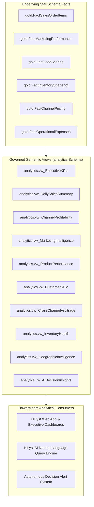

# Phase 8 — Enterprise Semantic Metric Catalog (Single Source of Truth)

> **Platform:** HiLyst Unified Business Intelligence & Decision Intelligence Platform 
> **Data Warehouse:** `HiLyst_UnifiedCommerceDW` 
> **Schema:** `analytics` & `gold` 
> **Author:** Antigravity Analytics Engineering & Semantic Layer Team 
> **Date:** September 2026 

---

## 1. Metric Catalog Architecture & Governance Principles

The HiLyst Metric Catalog establishes strict metric definitions to prevent metric drift across dashboards, reports, and AI agent text-to-SQL generation.

---

## 2. Core Business Metric Dictionary (35 Formalized KPIs)

### 2.1 Commercial & Financial Revenue Metrics

| Metric Name | Business Definition | Exact SQL Calculation Formula | Grain & Source Fact | Slicing Dimensions |
| :--- | :--- | :--- | :--- | :--- |
| **Gross Merchandise Value (GMV)** | Total gross booking value before discounts, returns, or cancellations | `SUM(f.GrossAmount)` | Order Line Item (`FactSalesOrderItems`) | Date, Channel, Product, Location |
| **Net Realized Revenue** | Realized top-line revenue from delivered and fulfilled orders | `SUM(CASE WHEN f.IsCancelled = 0 THEN f.NetAmount ELSE 0.00 END)` | Order Line Item (`FactSalesOrderItems`) | Date, Channel, Product, Customer |
| **Cost of Goods Sold (COGS)** | Total unit transfer cost or weighted landing cost of sold items | `SUM(CASE WHEN f.IsCancelled = 0 THEN f.EstimatedUnitCost * f.Quantity ELSE 0.00 END)` | Order Line Item (`FactSalesOrderItems`) | Date, Channel, Product |
| **Gross Profit (₹)** | Realized revenue minus COGS | `Net Revenue - COGS` | Order Line Item (`FactSalesOrderItems`) | Date, Channel, Product |
| **Gross Margin %** | Proportion of net revenue retained after product cost | `(Gross Profit / Net Revenue) * 100.0` | Order Line Item (`FactSalesOrderItems`) | Date, Channel, Product |
| **Average Order Value (AOV)** | Average realized net revenue per non-cancelled customer order | `Net Revenue / COUNT(DISTINCT CASE WHEN f.IsCancelled = 0 THEN f.OrderID END)` | Distinct Order (`FactSalesOrderItems`) | Date, Channel, Location |
| **Average Unit Price (AUP)** | Realized revenue per physical unit sold | `Net Revenue / SUM(CASE WHEN f.IsCancelled = 0 THEN f.Quantity ELSE 0 END)` | Unit Sold (`FactSalesOrderItems`) | Date, Product, Category |

### 2.2 Order Lifecycle & Operational Quality Metrics

| Metric Name | Business Definition | Exact SQL Calculation Formula | Grain & Source Fact | Slicing Dimensions |
| :--- | :--- | :--- | :--- | :--- |
| **Order Volume** | Total count of distinct orders received | `COUNT(DISTINCT f.OrderID)` | Distinct Order (`FactSalesOrderItems`) | Date, Channel, Location |
| **Line Item Volume** | Total distinct order line items processed | `COUNT(f.SalesOrderItemKey)` | Order Line (`FactSalesOrderItems`) | Date, Channel, Product |
| **Total Units Sold** | Total physical pieces ordered and fulfilled | `SUM(f.Quantity)` | Unit (`FactSalesOrderItems`) | Date, Channel, Product |
| **Cancellation Rate %** | Percentage of orders cancelled prior to fulfillment | `(COUNT(DISTINCT CASE WHEN f.IsCancelled = 1 THEN f.OrderID END) / COUNT(DISTINCT f.OrderID)) * 100.0` | Distinct Order (`FactSalesOrderItems`) | Channel, Fulfillment, Location |
| **Return Rate %** | Percentage of shipped orders returned by customers | `(COUNT(DISTINCT CASE WHEN f.IsReturned = 1 THEN f.OrderID END) / COUNT(DISTINCT CASE WHEN f.IsShipped = 1 THEN f.OrderID END)) * 100.0` | Shipped Order (`FactSalesOrderItems`) | Channel, Product, Location |
| **Fulfillment Delivery Rate %**| Percentage of orders successfully delivered to buyers | `(COUNT(DISTINCT CASE WHEN f.IsDelivered = 1 THEN f.OrderID END) / COUNT(DISTINCT f.OrderID)) * 100.0` | Distinct Order (`FactSalesOrderItems`) | Channel, Fulfillment Partner |

### 2.3 Digital Marketing & Attribution Metrics

| Metric Name | Business Definition | Exact SQL Calculation Formula | Grain & Source Fact | Slicing Dimensions |
| :--- | :--- | :--- | :--- | :--- |
| **Total Ad Spend** | Cumulative marketing ad spend across paid search and social channels | `SUM(m.SpendAmount)` | Daily Campaign Log (`FactMarketingPerformance`) | Date, Platform, Campaign, Device |
| **Total Impressions** | Total number of ad views served to prospective buyers | `SUM(m.Impressions)` | Daily Campaign Log (`FactMarketingPerformance`) | Platform, Campaign, Device |
| **Total Clicks** | Number of paid clicks through to landing pages or storefronts | `SUM(m.Clicks)` | Daily Campaign Log (`FactMarketingPerformance`) | Platform, Campaign, Device |
| **Click-Through-Rate (CTR %)** | Percentage of impressions resulting in ad clicks | `(SUM(m.Clicks) / NULLIF(SUM(m.Impressions), 0)) * 100.0` | Aggregated Log (`FactMarketingPerformance`) | Platform, Campaign, Device |
| **Cost Per Click (CPC ₹)** | Average cost incurred per individual user click | `SUM(m.SpendAmount) / NULLIF(SUM(m.Clicks), 0)` | Aggregated Log (`FactMarketingPerformance`) | Platform, Campaign, Keyword |
| **Cost Per Acquisition (CAC ₹)**| Marketing spend required to generate one paying customer conversion | `SUM(m.SpendAmount) / NULLIF(SUM(m.Conversions), 0)` | Aggregated Log (`FactMarketingPerformance`) | Platform, Campaign, Device |
| **Return on Ad Spend (ROAS)** | Attributed sales revenue generated per rupee of advertising spend | `SUM(m.RevenueGenerated) / NULLIF(SUM(m.SpendAmount), 0)` | Aggregated Log (`FactMarketingPerformance`) | Platform, Campaign, Device |

### 2.4 Inventory Velocity & Supply Chain Health Metrics

| Metric Name | Business Definition | Exact SQL Calculation Formula | Grain & Source Fact | Slicing Dimensions |
| :--- | :--- | :--- | :--- | :--- |
| **Stock on Hand (SOH)** | Total physical units stored in central fulfillment warehouse | `SUM(i.StockOnHand)` | SKU Snapshot (`FactInventorySnapshot`) | Product, Category, Size |
| **Inventory Valuation (Cost)** | Total tied capital valued at product transfer/manufacturing cost | `SUM(i.StockOnHand * p.TransferPrice)` | SKU Snapshot (`FactInventorySnapshot`) | Product, Category |
| **Inventory Valuation (MRP)** | Total retail value of stock on hand at base maximum retail price | `SUM(i.StockOnHand * p.BaseMRP)` | SKU Snapshot (`FactInventorySnapshot`) | Product, Category |
| **Daily Sales Velocity** | Average units sold per day over rolling 30-day window | `Units Sold (30D) / 30.0` | SKU Window Aggregation (`FactSalesOrderItems`) | Product, SKU |
| **Days of Inventory (DOI)** | Number of days until current warehouse stock is fully depleted | `StockOnHand / NULLIF(Daily Sales Velocity, 0)` | SKU Calculated Measure | Product, SKU |
| **Stockout Risk Flag** | Indicator for fast-moving items with fewer than 7 days of supply | `CASE WHEN DOI <= 7.0 AND StockOnHand > 0 THEN 1 ELSE 0 END` | SKU Alert Flag | Product, SKU |
| **Dead Stock Capital** | Capital locked in items with $>180$ days of supply or zero velocity | `SUM(CASE WHEN DOI > 180.0 OR DOI IS NULL THEN StockOnHand * TransferPrice ELSE 0 END)` | SKU Inventory Valuation | Product, Category |

### 2.5 Customer Intelligence & RFM Metrics

| Metric Name | Business Definition | Exact SQL Calculation Formula | Grain & Source Fact | Slicing Dimensions |
| :--- | :--- | :--- | :--- | :--- |
| **Active Customer Count** | Distinct customer entities with at least one order | `COUNT(DISTINCT f.CustomerKey)` | Conformed Profile (`DimCustomer`) | CustomerType, City, State |
| **Recency (Days)** | Number of elapsed days since customer's most recent purchase | `DATEDIFF(DAY, MAX(dd.FullDate), GETDATE())` | Customer Lifetime Aggregation | Customer Profile |
| **Frequency (Orders)** | Total lifetime orders placed by customer | `COUNT(DISTINCT f.OrderID)` | Customer Lifetime Aggregation | Customer Profile |
| **Monetary Value (₹)** | Total cumulative net revenue realized from customer | `SUM(f.NetAmount)` | Customer Lifetime Aggregation | Customer Profile |
| **Lead Quality Tier** | Propensity classification based on salary and conversion history | `Tiers 1-4 mapped from salary and click engagement` | Lead Fact (`FactLeadScoring`) | Lead Profile, Location |

### 2.6 Multi-Channel Arbitrage & Pricing Metrics

| Metric Name | Business Definition | Exact SQL Calculation Formula | Grain & Source Fact | Slicing Dimensions |
| :--- | :--- | :--- | :--- | :--- |
| **Max Channel Spread (₹)** | Difference between highest and lowest external marketplace price | `MAX(cp.ChannelMRP) - MIN(cp.ChannelMRP)` | Product Style (`FactChannelPricing`) | Product, StyleCode |
| **Arbitrage Opportunity %** | Spread percentage relative to internal transfer cost | `(Max Channel Spread / TransferPrice) * 100.0` | Product Style (`FactChannelPricing`) | Product, StyleCode |
| **Price Parity Violation Flag**| Marketplace listing price lower than authorized minimum MAP | `CASE WHEN ChannelMRP < MAP_Price THEN 1 ELSE 0 END` | Channel Pricing Record | Channel, StyleCode |
| **Gross Margin Arbitrage** | Additional gross margin captured by reallocating inventory to premium channel | `(Myntra MRP - Amazon FBA MRP) * Inventory Allocated` | Channel Optimization Model | Product Style |
